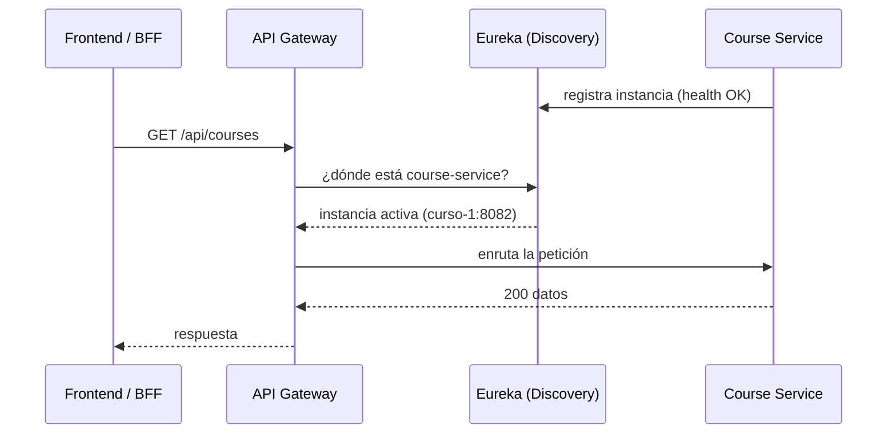
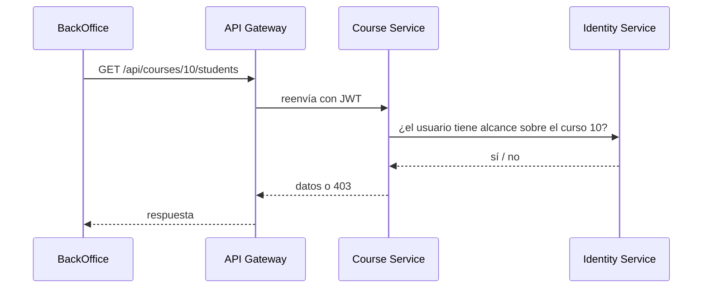
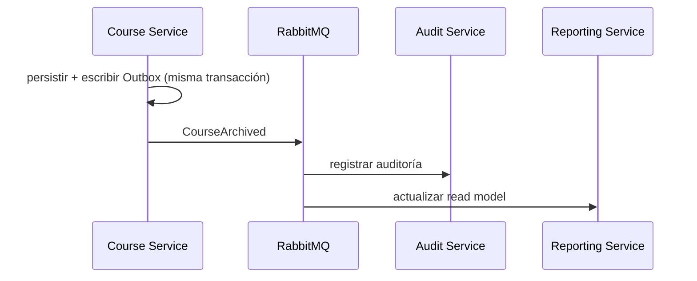
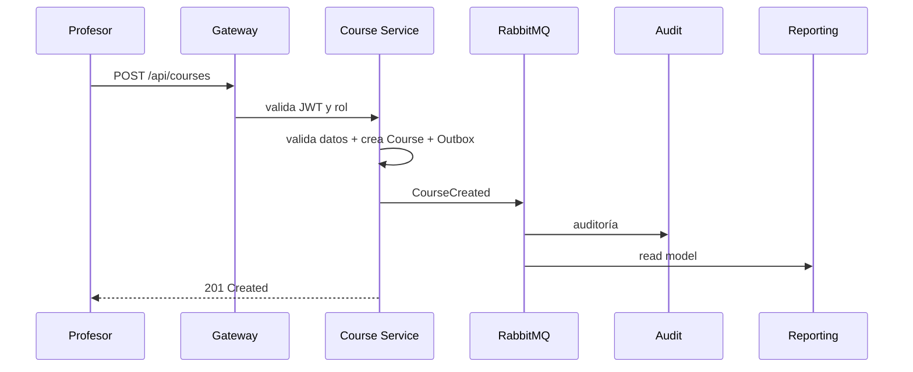
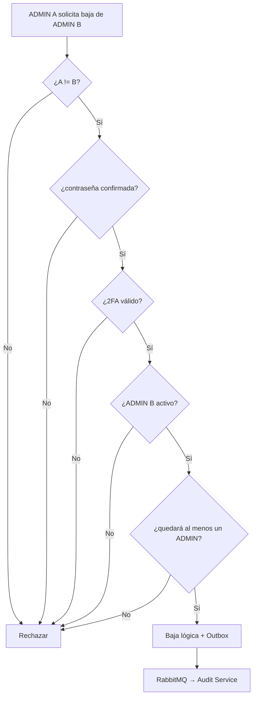

# Comunicación entre microservicios

Tres piezas complementarias: **Service Discovery**, comunicación síncrona y asíncrona.

## Service Discovery — Eureka

Cada microservicio se **registra en Eureka al iniciar** (nombre, IP, puerto, health). El **API Gateway no conoce direcciones fijas**: consulta a Eureka la ubicación de la instancia activa antes de enrutar. Así, una instancia nueva se suma sola y una caída se descarta automáticamente.



> El **Config Server** complementa: los servicios toman su configuración no sensible (URLs internas, feature flags, perfiles) desde el Config Server al arrancar, y los secretos desde variables de entorno.

## Síncrona — HTTP/REST

Cuando se necesita respuesta inmediata (consultas, validaciones para completar una operación).



## Asíncrona — Eventos RabbitMQ

Para procesos desacoplados: auditoría, read models, notificaciones, propagación de cambios.



## Patrón Outbox

Evita perder un evento tras confirmar una transacción:

```text
BEGIN TRANSACTION
  UPDATE course SET status = 'ARCHIVED' ...
  INSERT OutboxEvent(type = 'CourseArchived', payload = ...)
COMMIT
        │
        ▼
   Publisher → RabbitMQ
```

## Idempotencia en consumidores

Cada evento lleva `event_id`. El consumidor registra qué eventos ya procesó:

```text
¿event_id ya procesado?
    ├── sí → ignorar
    └── no → procesar + registrar en ProcessedEvent
```

## Eventos de dominio (ejemplos)

```text
UserCreated · AdminDeleted · AdminRecoveryExecuted
GlobalConfigurationChanged
CourseCreated · CourseUpdated · CourseActivated · CourseArchived
RosterUpdated
ChallengeCreated · ChallengeUpdated
RetentionDecisionCreated · DataAnonymized
```

**Formato común de evento:**

```json
{
  "eventId": "uuid",
  "eventType": "CourseArchived",
  "occurredAt": "2026-08-28T12:00:00Z",
  "correlationId": "uuid",
  "actorId": "uuid",
  "source": "course-service",
  "payload": {}
}
```

## Flujo crítico: creación de curso



## Flujo crítico: baja de ADMIN



> La protección del último ADMIN debe manejarse con **transacción y revalidación** (concurrencia), no solo con validación previa.