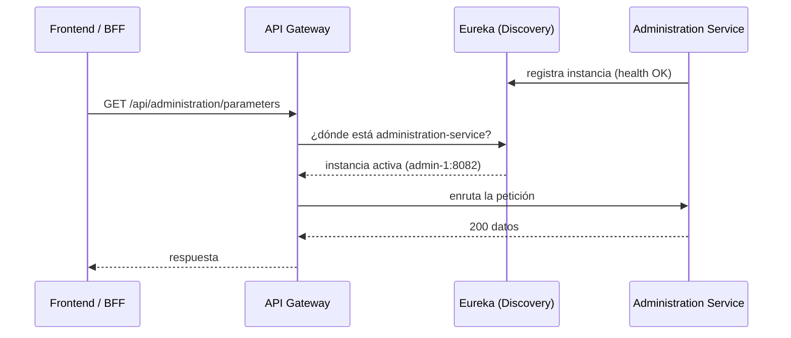
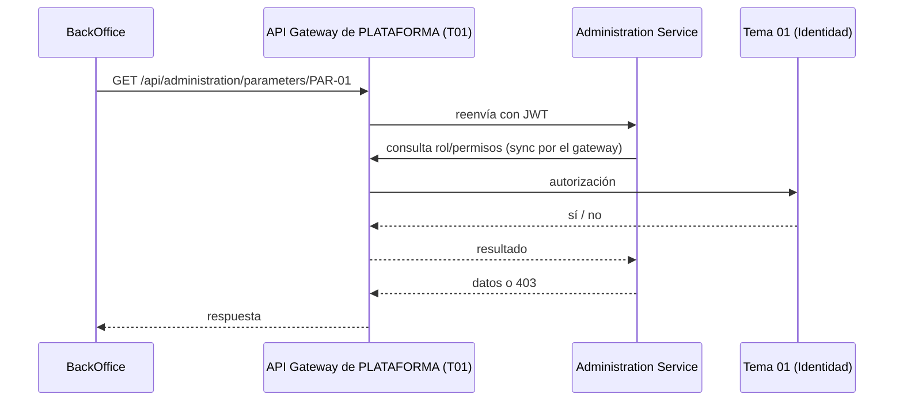
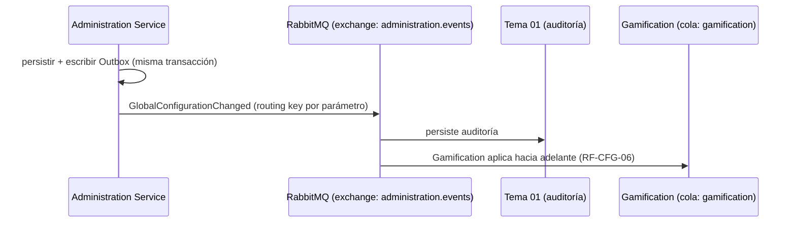
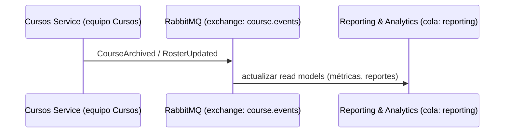
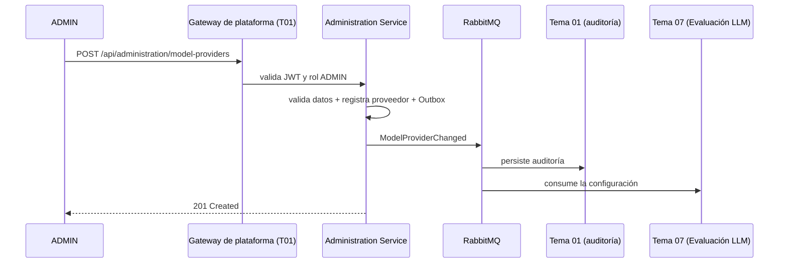
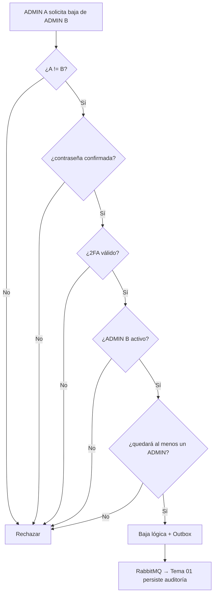

# Comunicación entre microservicios

Tres piezas complementarias: **Service Discovery**, comunicación síncrona y asíncrona.

## Service Discovery — Eureka

Cada microservicio se **registra en Eureka al iniciar** (nombre, IP, puerto, health). El **API Gateway no conoce direcciones fijas**: consulta a Eureka la ubicación de la instancia activa antes de enrutar. Así, una instancia nueva se suma sola y una caída se descarta automáticamente.



> El **Config Server** complementa: los servicios toman su configuración no sensible (URLs internas, feature flags, perfiles) desde el Config Server al arrancar, y los secretos desde variables de entorno.

## Síncrona — HTTP/REST

Cuando se necesita respuesta inmediata (consultas, validaciones para completar una operación).



## Asíncrona — Eventos RabbitMQ

Para procesos desacoplados: auditoría, read models, propagación de cambios. **RabbitMQ** es el broker elegido (ADR-003); Apache **Kafka** queda como alternativa. Patrón **híbrido**: REST por el gateway para lo síncrono + eventos por RabbitMQ para avisar, con **caché local con TTL** en los consumidores.

**Publicación (BackOffice):**



**Consumo (reportes/métricas):**



### Exchanges y colas

| Exchange | Eventos | Rol BackOffice | Cola por consumidor |
|---|---|---|---|
| `identity.events` | AdminCreated, AdminDeleted, AdminRecoveryExecuted, RoleChanged | Publica | `audit`, `reporting`… |
| `administration.events` | GlobalConfigurationChanged, ModelProviderChanged, ModelFunctionChanged | Publica | `gamification`, `challenges`, `bank`, `roadmap`… |
| `audit.events` | eventos de auditoría | Publica | `audit` |
| `retention.events` | RetentionDecisionCreated, DataAnonymized | Publica | `audit`, `reporting`… |
| `course.events` | CourseCreated/Activated/Archived, RosterUpdated | **Consume** | `reporting` |
| `gamification.events` / `ranking.events` / `survey.events` | eventos de otros equipos | **Consume** | `reporting` |

Cada **cola** pertenece a un consumidor. **Idempotencia por `event_id` y por `version`** (descarta `v ≤ local`). Los **read models de Reporting se reconstruyen vía contratos de lectura REST** (no dependen del historial del broker). Los consumidores de parámetros usan **caché local con TTL 10 min** que el evento invalida antes (respaldo ante caída del Backoffice).

## Patrón Outbox

Evita perder un evento tras confirmar una transacción:

```text
BEGIN TRANSACTION
  UPDATE GlobalParameter SET value = ... (nueva versión)
  INSERT OutboxEvent(type = 'GlobalConfigurationChanged', payload = ...)
COMMIT
        │
        ▼
   Publisher → RabbitMQ (exchange administration.events)
```

## Idempotencia en consumidores

Cada evento lleva `event_id`. El consumidor registra qué eventos ya procesó:

```text
¿event_id ya procesado?
    ├── sí → ignorar
    └── no → procesar + registrar en ProcessedEvent
```

## Eventos de dominio (ejemplos)

```text
AdminDeleted · AdminRecoveryExecuted · RoleChanged
GlobalConfigurationChanged · ModelProviderChanged · ModelFunctionChanged
RetentionDecisionCreated · DataAnonymized
```
> El BackOffice también **consume**: CourseArchived/RosterUpdated (Cursos), eventos de Gamificación/Ranking/Encuestas.

**Formato común de evento:**

```json
{
  "eventId": "uuid",
  "eventType": "ModelProviderChanged",
  "occurredAt": "2026-08-28T12:00:00Z",
  "correlationId": "uuid",
  "actorId": "uuid",
  "source": "administration-service",
  "payload": {}
}
```

## Flujo crítico: gestión de proveedor de modelo (ADMIN)



## Flujo crítico: baja de ADMIN — **del Tema 01 (consumido)**



> La protección del último ADMIN debe manejarse con **transacción y revalidación** (concurrencia), no solo con validación previa.