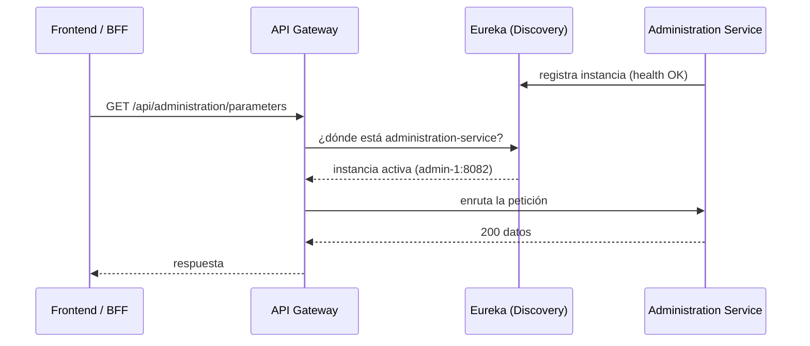
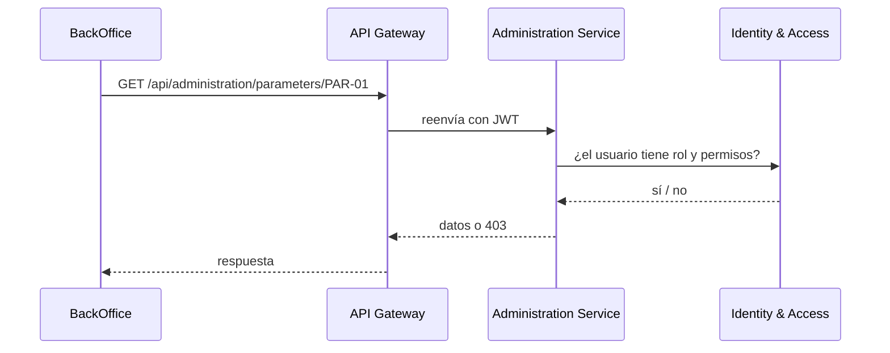
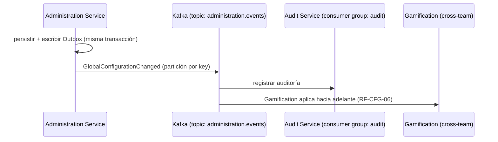
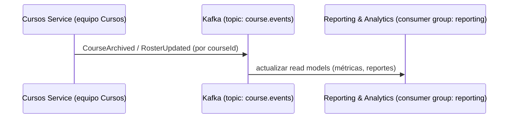
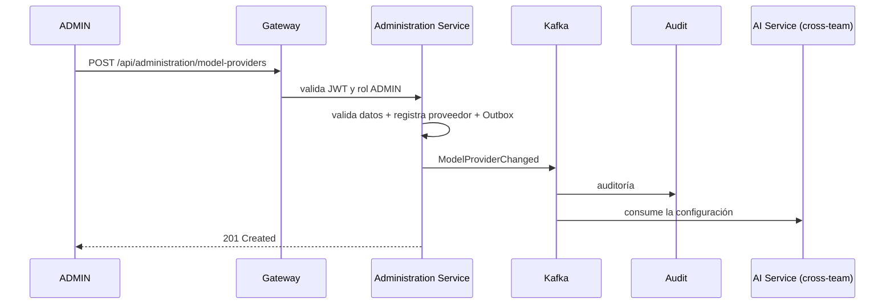
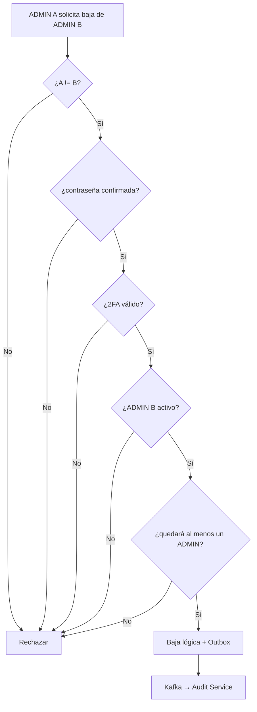

# Comunicación entre microservicios

Tres piezas complementarias: **Service Discovery**, comunicación síncrona y asíncrona.

## Service Discovery — Eureka

Cada microservicio se **registra en Eureka al iniciar** (nombre, IP, puerto, health). El **API Gateway no conoce direcciones fijas**: consulta a Eureka la ubicación de la instancia activa antes de enrutar. Así, una instancia nueva se suma sola y una caída se descarta automáticamente.



> El **Config Server** complementa: los servicios toman su configuración no sensible (URLs internas, feature flags, perfiles) desde el Config Server al arrancar, y los secretos desde variables de entorno.

## Síncrona — HTTP/REST

Cuando se necesita respuesta inmediata (consultas, validaciones para completar una operación).



## Asíncrona — Eventos Apache Kafka

Para procesos desacoplados: auditoría, read models, propagación de cambios. **Kafka** es el broker elegido (ADR-003); RabbitMQ queda como alternativa.

**Publicación (BackOffice):**



**Consumo (reportes/métricas):**



### Topics y particionado

| Topic | Eventos | Rol BackOffice | Particionado |
|---|---|---|---|
| `identity.events` | AdminCreated, AdminDeleted, AdminRecoveryExecuted, RoleChanged | Publica | por `actorId` |
| `administration.events` | GlobalConfigurationChanged, ModelProviderChanged, ModelFunctionChanged | Publica | por `key` |
| `audit.events` | eventos de auditoría | Publica | por `actorId` |
| `retention.events` | RetentionDecisionCreated, DataAnonymized | Publica | por `resourceId` |
| `course.events` | CourseCreated/Activated/Archived, RosterUpdated | **Consume** | por `courseId` |
| `gamification.events` / `ranking.events` / `survey.events` | eventos de otros equipos | **Consume** | por `courseId` |

Cada **consumer group** (un servicio) lee con su offset propio. Kafka permite **replay**: reconstruir read models de Reporting o la auditoría desde cero (clave para RF-AUD-04).

## Patrón Outbox

Evita perder un evento tras confirmar una transacción:

```text
BEGIN TRANSACTION
  UPDATE GlobalParameter SET value = ... (nueva versión)
  INSERT OutboxEvent(type = 'GlobalConfigurationChanged', payload = ...)
COMMIT
        │
        ▼
   Publisher → Kafka (topic administration.events)
```

## Idempotencia en consumidores

Cada evento lleva `event_id`. El consumidor registra qué eventos ya procesó:

```text
¿event_id ya procesado?
    ├── sí → ignorar
    └── no → procesar + registrar en ProcessedEvent
```

## Eventos de dominio (ejemplos)

```text
AdminDeleted · AdminRecoveryExecuted · RoleChanged
GlobalConfigurationChanged · ModelProviderChanged · ModelFunctionChanged
RetentionDecisionCreated · DataAnonymized
```
> El BackOffice también **consume**: CourseArchived/RosterUpdated (Cursos), eventos de Gamificación/Ranking/Encuestas.

**Formato común de evento:**

```json
{
  "eventId": "uuid",
  "eventType": "ModelProviderChanged",
  "occurredAt": "2026-08-28T12:00:00Z",
  "correlationId": "uuid",
  "actorId": "uuid",
  "source": "administration-service",
  "payload": {}
}
```

## Flujo crítico: gestión de proveedor de modelo (ADMIN)



## Flujo crítico: baja de ADMIN



> La protección del último ADMIN debe manejarse con **transacción y revalidación** (concurrencia), no solo con validación previa.