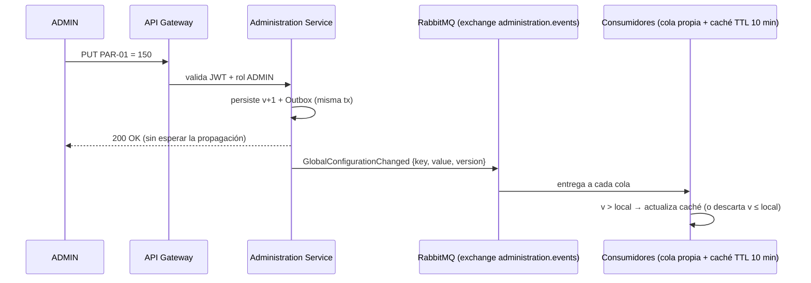

# Mensajería híbrida con RabbitMQ

> **Decisión:** patrón **híbrido** de comunicación — REST por el API Gateway para lo síncrono + **RabbitMQ** para eventos de configuración, con **caché local con TTL** en los consumidores. Apache **Kafka** queda documentado como alternativa.

## 1. Por qué un patrón híbrido

En el Backoffice conviven dos tipos de necesidad de comunicación:

1. **Síncrona (REST por el gateway):** consultas, operaciones y contratos de lectura que necesitan **respuesta inmediata** (ej. validar la pertenencia a una cohorte contra la matrícula T02).
2. **Asíncrona (eventos por RabbitMQ):** **avisar** cambios de configuración global (PAR-01..24, proveedores LLM) a los consumidores, sin que la respuesta al ADMIN dependa de la propagación.

La regla que separa ambos caminos es simple: **REST responde preguntas u operaciones; los eventos notifican cambios que otros deben conocer.** RabbitMQ **no reemplaza** al gateway ni convierte la arquitectura en event-driven: es un segundo camino, acotado, para avisar.

## 2. Por qué RabbitMQ (y no otro broker)

- **Liviano y simple de operar:** suficiente para la escala de la plataforma (120 sesiones, pocos eventos por segundo); fácil de levantar y monitorear en Docker.
- **Adecuado al caso de uso:** publicación de cambios de configuración (broadcast) mediante **exchange + cola por consumidor**.
- **Soporte maduro con Spring:** Spring AMQP (RabbitTemplate/Listener).
- **Colas por consumidor:** cada microservicio recibe lo que le interesa y lo procesa a su ritmo.

**Alternativa considerada — Apache Kafka:** ofrece replay/histórico y particionado por `courseId`. No es necesario como principal porque los **read models de Reporting se reconstruyen vía contratos de lectura REST** desde los dominios dueños, no desde el historial del broker.

## 3. Cómo fluye un cambio de configuración



**Mecanismo en los consumidores (caché con TTL 10 min):**
- Cada consumidor guarda los parámetros en una **caché local con TTL de 10 minutos** (versión + valor).
- El **evento invalida/actualiza** la caché antes del vencimiento.
- Si el evento no llega, el TTL actúa como respaldo (a lo sumo 10 minutos con un valor anterior).
- Si **Backoffice está caído**, el consumidor sigue sirviendo el **último valor conocido** (no se bloquea la operación).

**Estados de la caché:** vacía → vigente (valor v_n) → invalidada (por evento) → vencida (por TTL).

## 4. Contrato mínimo del evento

El evento identifica el cambio, no transporta lógica de negocio. Con la **versión**, el consumidor descarta eventos repetidos o antiguos:

```json
{
  "eventId": "9f2c…",
  "parameterKey": "PAR-01",
  "version": 42,
  "value": 150,
  "validFrom": "2026-09-01T14:00:00Z",
  "timestamp": "2026-09-01T14:00:01Z"
}
```

**Garantías por paso:**
- **Persistir antes de publicar (Outbox):** si el broker no está, el parámetro ya quedó guardado y el TTL de 10 min actúa como respaldo. El **Outbox** garantiza que el evento no se pierda tras el commit.
- **Cola propia por consumidor:** cada servicio recibe solo lo que le interesa.
- **Invalidación idempotente:** versión recibida `≤` versión local → se descarta (RF-CFG-06: los cambios rigen hacia adelante; el evento representa la configuración vigente, nunca una orden de recalcular históricos).

## 5. Exchange y colas del Backoffice

| Exchange | Eventos | Cola por consumidor |
|---|---|---|
| `administration.events` | GlobalConfigurationChanged, ModelProviderChanged, ModelFunctionChanged | `gamification`, `challenges`, `bank`, `roadmap`… |
| `audit.events` | eventos de auditoría | `audit` |
| `retention.events` | RetentionDecisionCreated, DataAnonymized | `audit`, `reporting`… |
| `identity.events` | AdminCreated/Deleted, RoleChanged | `audit`, `reporting`… |
| `course.events` / `gamification.events` / `ranking.events` / `survey.events` | eventos de otros temas (consumo) | `reporting` |

## 6. Relación con el resto de la propuesta

- **Multitenancy + RLS** (aislamiento de datos) es **independiente** de este mecanismo: la mensajería define *cómo viajan los cambios*; el multitenancy define *cómo se separan los datos*. Ambos conviven (ver [Multitenancy y RLS](/backend/arquitectura/multitenancy)).
- **Outbox + idempotencia** por `event_id` y `version` son la base de confiabilidad.
- **Validación con la cátedra:** el broker es infraestructura compartida de la plataforma → se coordina con los demás equipos y se valida la elección de RabbitMQ.

> Patrón documentado en ADR-003 y detallado en las tareas de configuración (ver [Registro de parámetros](/msii/tareas/registro-parametros)).