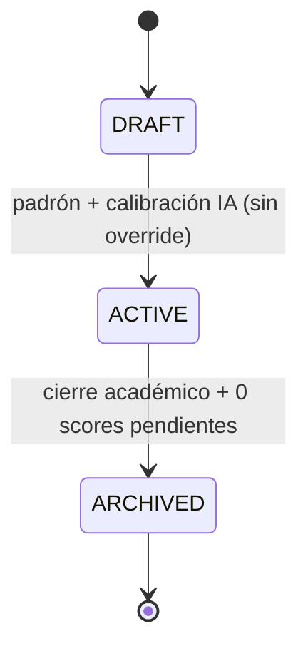

# Patrones de diseño aplicados

> Mapa de patrones GoF/Catálogo con el **lugar concreto** donde se aplican, el requisito que resuelven y el beneficio. Paquetes bajo `com.backoffice.<servicio>`.

## Domain

### State — Ciclo de vida de Course

- **Dónde:** `course.domain.state` — `CourseState` (interface) + `DraftState`, `ActiveState`, `ArchivedState`.
- **Resuelve:** RF-CUR-04/06/07.
- **Beneficio:** las guardas de transición (activar exige padrón + calibración IA; archivar exige cierre académico + cero scores) viven en el dominio, no en controllers.

### Specification — Reglas compuestas

- **Dónde:** `course.domain.specifications` (`CanActivateCourseSpec`, `CanArchiveCourseSpec`), `identity.domain.specifications` (`AtLeastOneActiveAdminSpec`).
- **Resuelve:** RF-CUR-08b, RF-IA-36, RF-ROL-05.
- **Beneficio:** reglas combinables (AND/OR), testeables aisladamente y reutilizables entre servicios.

### Strategy — Políticas intercambiables

- **Dónde:** `course.domain.rewards` (`RewardStrategy` + `Basic/Medium/AdvancedRewardStrategy`), `configuration.domain.retention` (`RetentionDecisionStrategy`: extender vs anonimizar).
- **Resuelve:** RF-DES-07, RF-CFG-04, RF-RET-03.
- **Beneficio:** el caso de uso no cambia cuando se ajusta una política.

### Null Object — Dependencia externa no disponible

- **Dónde:** `course.infrastructure.external` (`CalibrationClient` + `NoOpCalibrationClient`).
- **Resuelve:** RF-IA-27 (la caída de una dependencia nunca bloquea la operación).
- **Beneficio:** comportamiento neutro explícito, sin `if (client == null)`.

### Prototype — Curso desde template

- **Dónde:** `course.domain` — `CourseTemplate.clone()`.
- **Resuelve:** RF-CUR-02.
- **Beneficio:** clona la estructura del roadmap sin acoplar template y curso.

## Application

### Command — Casos de uso como objetos

- **Dónde:** `*.application.commands` (`CreateCourseCommand`, `ActivateCourseCommand`, `ArchiveCourseCommand` + handlers).
- **Resuelve:** estructura de capas; CQRS ligero.
- **Beneficio:** aísla HTTP del dominio; cada comando es testeable y auditable.

### Chain of Responsibility — Pipeline de validación

- **Dónde:** `identity.application.validation` (`AdminDeletionValidator`: auto-eliminación → 2FA → confirmación escrita → último ADMIN), alcance por recurso en `course.api.security`.
- **Resuelve:** RF-ROL-06, RF-USR-06.
- **Beneficio:** cada validador es independiente y falla con su propio error.

### Decorator — Auditoría transversal

- **Dónde:** `audit.application` (`AuditableCommandDecorator`).
- **Resuelve:** RF-AUD-01/03.
- **Beneficio:** la auditoría se compone sobre el comando sin ensuciar el caso de uso.

### Template Method — Import de padrón

- **Dónde:** `course.application.roster` (`RosterImportTemplate`: validar → normalizar → acumular → reportar).
- **Resuelve:** RF-USR-05d.
- **Beneficio:** reutiliza el flujo de carga masiva; solo varía el parseo.

## Infrastructure

### Adapter — Clientes a servicios externos

- **Dónde:** `course.infrastructure.external` (`IdentityClient`, `CalibrationClient`, `RankingClient`).
- **Resuelve:** contratos cross-team.
- **Beneficio:** aísla red y DTOs; testeo con mocks.

### Observer + Outbox — Eventos de dominio

- **Dónde:** `*.domain.events` + `*.messaging.outbox`.
- **Resuelve:** §12/§13, ADR-003.
- **Beneficio:** el dominio publica eventos puros; el Outbox garantiza la entrega en la misma transacción.

### Unit of Work — Transacción con Outbox

- **Dónde:** servicio `@Transactional` que persiste entidad + `OutboxMessage` en el mismo commit.
- **Resuelve:** §13.
- **Beneficio:** consistencia entre el cambio de negocio y su evento.

### Idempotency Key — operaciones críticas

- **Dónde:** `*.api.filter` / `*.application.commands` — interceptor que registra `Idempotency-Key` procesadas (PUT de configuración, baja de ADMIN, activación/archivado de curso).
- **Resuelve:** peticiones duplicadas; complemento del rate limiting (429) y del single-flight del front.
- **Beneficio:** ante un duplicado, el backend responde el resultado original en vez de re-ejecutar.

## Tabla resumen

| Patrón | Paquete propuesto | RF | Servicio |
|---|---|---|---|
| State | `course.domain.state` | RF-CUR-04/06/07 | Course |
| Specification | `course.domain.specifications` · `identity.domain.specifications` | RF-CUR-08b · RF-ROL-05 | Course / Identity |
| Strategy | `course.domain.rewards` · `configuration.domain.retention` | RF-DES-07 · RF-RET-03 | Course / Configuration |
| Null Object | `course.infrastructure.external` | RF-IA-27 | Course |
| Prototype | `course.domain` | RF-CUR-02 | Course |
| Command | `*.application.commands` | capas | Todos |
| Chain of Responsibility | `identity.application.validation` | RF-ROL-06 | Identity |
| Decorator | `audit.application` | RF-AUD-01/03 | Audit |
| Template Method | `course.application.roster` | RF-USR-05d | Course |
| Adapter | `*.infrastructure.external` | cross-team | Todos |
| Observer + Outbox | `*.domain.events` · `*.messaging.outbox` | §12/§13 | Todos |
| Unit of Work | servicio `@Transactional` | §13 | Todos |
| Idempotency Key | `*.api.filter` · `*.application.commands` | §9.1 / 429 | Todos (críticas) |