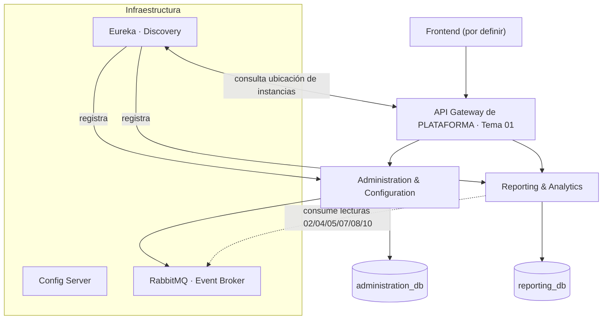

# Arquitectura — Vista general

> Estilo: **microservicios orientados a dominios**. El Backoffice (Tema 12) es **consumidor puro** con **2 servicios propietarios**; identidad/roles/auditoría (Tema 01), cohorte (Tema 02) y los demás temas se consumen/leen.

## Diagrama

## Componentes

| Componente | Rol |
|---|---|
| **API Gateway** | **De plataforma (Tema 01)**: única puerta, JWT, rate limiting (429 con `Retry-After`), correlation ID. **Toda llamada síncrona entre servicios pasa por acá.** |
| **Eureka** | Service Discovery: los servicios se registran al iniciar y el Gateway consulta la ubicación de la instancia activa. |
| **Config Server** | Configuración centralizada no sensible; perfiles por ambiente. |
| **RabbitMQ** | Eventos de dominio, read models. Read models (reporting) reconstruidos vía contratos de lectura. |
| **2 microservicios** | Ver página [Microservicios](/backend/arquitectura/microservicios). |

## Principios clave

- **Consumidor puro:** el Backoffice no es dueño de identidad, cohorte, desafíos ni economía; consume/lee por **contratos de lectura** (Temas 02/04/05/07/08/10).
- **Sync por el gateway:** no hay comunicación directa entre microservicios (regla no negociable).
- **Validar ≠ autorizar:** el gateway valida el token; la autorización la toma el servicio dueño de la regla.
- **Database per Service** y **Outbox + idempotencia** para eventos.
- **Correlation ID** en todo el recorrido.

## Alcance por dato (reportes/métricas)

El alcance del PROFESOR sobre una cohorte se valida contra la **matrícula del Tema 02** (cross-team); el `course_id` del request nunca se acepta ciegamente.