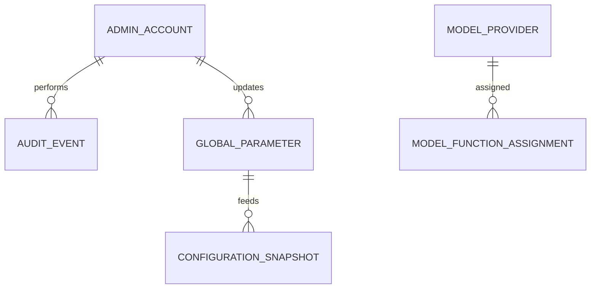

# Modelo de datos

> Database per Service. Solo los **4 servicios del BackOffice**; los dominios de otros equipos (cursos, desafíos, usuarios) se consumen vía eventos, no se modelan acá.

## 1. identity_db — cuentas administrativas

| Campo | Tipo | Notas |
|---|---|---|
| id | UUID | PK |
| first_name / last_name | varchar(100) | |
| email | varchar(255) | único, whitelist |
| password_hash | varchar(255) | bcrypt |
| role | enum | ADMIN \| PROFESOR |
| two_factor_enabled | boolean | |
| status | enum | ACTIVE \| DISABLED |
| created_at / deleted_at | timestamp | baja lógica |

> El dominio de usuarios/alumnos (avatar, perfil, onboarding) es del equipo Usuarios.

## 2. administration_db — configuración y proveedores de modelo

**GlobalParameter**

| Campo | Tipo | Notas |
|---|---|---|
| id | UUID | PK |
| key | varchar(20) | PAR-01..PAR-18 |
| value | jsonb | versionado (RF-CFG-06) |
| version | int | incrementa por cambio |
| updated_by / updated_at | UUID / timestamp | |

**ModelProvider** (RF-IA-35)

| Campo | Tipo | Notas |
|---|---|---|
| id | UUID | PK |
| name | varchar(100) | ej. OpenAI, Anthropic |
| status | enum | ACTIVE \| RETIRED |
| created_by / created_at | UUID / timestamp | auditado |

**ModelFunctionAssignment** (RF-IA-23/24)

| Campo | Tipo | Notas |
|---|---|---|
| id | UUID | PK |
| function | enum | TUTOR \| EVALUATOR \| MODERATOR \| GENERATOR \| RAG_AGENT |
| model_id / model_version | UUID / varchar | |

**EvaluatorConfig** (RF-IA-25/28)

| Campo | Tipo | Notas |
|---|---|---|
| id | UUID | PK |
| model_id / model_version | UUID / varchar | evaluador único activo |
| rubric_version | varchar | |
| status | enum | PENDING_CALIBRATION \| ACTIVE \| RETIRED |

**GoldenSet** (RF-IA-30/31)

| Campo | Tipo | Notas |
|---|---|---|
| id | UUID | PK |
| version | varchar | versionado con la rúbrica |
| entries | jsonb | transcripciones puntuadas de referencia |
| tolerance_ok | boolean | dentro de PAR-14 |

## 3. reporting_db — read models (reportes, métricas, export)

```text
CourseMetricsSnapshot   ← course/gamification/ranking/survey events
TeacherReportSnapshot   ← eventos por curso
ConfigurationSnapshot   ← GlobalConfigurationChanged
ModelProviderSnapshot   ← cambios de proveedores/modelos
```

Reconstruibles por **replay** de Kafka.

## 4. audit_db — AuditEvent (inmutable)

| Campo | Tipo | Notas |
|---|---|---|
| id | UUID | PK |
| event_id | UUID | correlaciona con evento Kafka |
| actor_id / actor_role | UUID / enum | |
| action | varchar(100) | ADMIN_DELETED, GLOBAL_CONFIG_CHANGED, MODEL_PROVIDER_CHANGED |
| resource_type / resource_id | varchar | |
| timestamp | timestamp | UTC |
| result | enum | SUCCESS \| FAILURE \| BLOCKED |
| reason | varchar(255) | |
| correlation_id | UUID | |
| metadata | jsonb | |

## Relaciones principales (conceptuales)



## Reglas de datos transversales

- **Baja lógica** en toda producción académica: `deleted_at`, `deleted_by`, `deletion_reason`.
- **Encuestas:** solo agregados anónimos (RF-ENC-04/12); sin vínculo autor ↔ respuesta.
- **Retención:** 5 años desde el cierre; vencimiento → decisión de ADMIN (extender / anonimizar); nunca purga automática.