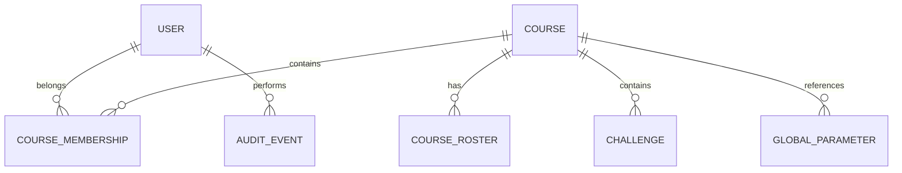

# Modelo de datos

> Database per Service. Modelo detallado por servicio (campos y tipos JPA); las relaciones entre dominios se representan con IDs (sin FKs entre bases).

## 1. identity_db — User

| Campo | Tipo | Notas |
|---|---|---|
| id | UUID | PK |
| first_name | varchar(100) | |
| last_name | varchar(100) | |
| legajo | varchar(20) | validado contra padrón (RF-USR-05b) |
| email | varchar(255) | único, institucional/whitelist |
| password_hash | varchar(255) | bcrypt |
| role | enum | ADMIN \| PROFESOR \| ALUMNO |
| status | enum | ACTIVE \| PENDING_VALIDATION \| DISABLED |
| validated_by | enum | ROSTER \| EXCEPTION \| NONE (RF-USR-05h) |
| two_factor_enabled | boolean | |
| created_at / deleted_at | timestamp | baja lógica (RF-NFR-01) |

## 2. course_db — Course / CourseRoster / Challenge

**Course**

| Campo | Tipo | Notas |
|---|---|---|
| id | UUID | PK |
| name | varchar(150) | |
| description | text | |
| owner_user_id | UUID | FK lógica → Identity |
| status | enum | DRAFT \| ACTIVE \| ARCHIVED |
| invitation_code | varchar(20) | único; regenerable (RF-USR-05g1) |
| created_at / archived_at / deleted_at | timestamp | |

**CourseRoster** (padrón, tenant-scoped) — índice único `(course_id, legajo)`

| Campo | Tipo | Notas |
|---|---|---|
| id | UUID | PK |
| course_id | UUID | tenant |
| legajo | varchar(20) | |
| email | varchar(255) | institucional |
| status | enum | ACTIVE \| REMOVED |
| imported_at / deleted_at | timestamp | |

**Challenge**

| Campo | Tipo | Notas |
|---|---|---|
| id | UUID | PK |
| course_id | UUID | tenant |
| title | varchar(200) | |
| difficulty | enum | BASICO \| MEDIO \| AVANZADO |
| required | boolean | RF-DES-06 |
| retry_count | int | 0–3 (RF-DES-07) |
| status | enum | DRAFT \| PUBLISHED \| RETIRED |
| created_by | UUID | FK lógica → Identity |

## 3. configuration_db — GlobalParameter

| Campo | Tipo | Notas |
|---|---|---|
| id | UUID | PK |
| key | varchar(20) | PAR-01..PAR-18 |
| value | jsonb | valor versionado (RF-CFG-06) |
| version | int | incrementa por cambio |
| updated_by | UUID | FK lógica → Identity |
| updated_at | timestamp | |

## 4. audit_db — AuditEvent (inmutable)

| Campo | Tipo | Notas |
|---|---|---|
| id | UUID | PK |
| event_id | UUID | correlaciona con evento Kafka |
| actor_id / actor_role | UUID / enum | |
| action | varchar(100) | ej. ADMIN_DELETED |
| resource_type / resource_id | varchar | |
| timestamp | timestamp | UTC |
| result | enum | SUCCESS \| FAILURE \| BLOCKED |
| reason | varchar(255) | overrides, excepciones |
| correlation_id | UUID | |
| metadata | jsonb | ip_hash, extra |

## 5. reporting_db — read models (reconstruibles por replay de Kafka)

```text
CourseSnapshot      ← CourseCreated/Activated/Archived
RosterSnapshot      ← RosterUpdated
ConfigurationSnapshot ← GlobalConfigurationChanged
```

## Relaciones principales (conceptuales)



## Reglas de datos transversales

- **Baja lógica** en toda producción académica: `deleted_at`, `deleted_by`, `deletion_reason`.
- **Encuestas:** dos registros desacoplados (marcador de cumplimiento por alumno + respuesta anónima) sin vínculo posible → se aplica en Reporting, no se reconstruye.
- **Retención:** 5 años desde el cierre; vencimiento → pendiente de decisión (extender / anonimizar); nunca purga automática.