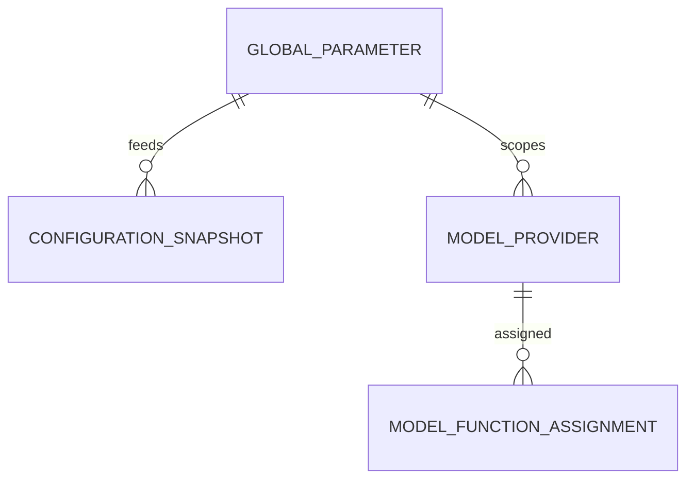

# Modelo de datos

> Database per Service. **Solo los 2 servicios propietarios del Backoffice**; identidad/roles/auditoría (Tema 01), cohorte (Tema 02) y los demás temas no se modelan acá (se consumen/leen).

## 1. administration_db — configuración y proveedores de modelo

**GlobalParameter**

| Campo | Tipo | Notas |
|---|---|---|
| id | UUID | PK |
| key | varchar(20) | PAR-01..PAR-24 (base PRD PAR-01..18; registro extensible) |
| value | jsonb | versionado (RF-CFG-06) |
| version | int | incrementa por cambio |
| updated_by / updated_at | UUID / timestamp | FK lógica → Tema 01 |

**ModelProvider** (RF-IA-35)

| Campo | Tipo | Notas |
|---|---|---|
| id | UUID | PK |
| name | varchar(100) | ej. OpenAI, Anthropic |
| status | enum | ACTIVE \| RETIRED |
| created_by / created_at | UUID / timestamp | auditado |

**ModelFunctionAssignment** (RF-IA-23/24)

| Campo | Tipo | Notas |
|---|---|---|
| id | UUID | PK |
| function | enum | TUTOR \| EVALUATOR \| MODERATOR \| GENERATOR \| RAG_AGENT |
| model_id / model_version | UUID / varchar | |

**EvaluatorConfig** (RF-IA-25/28)

| Campo | Tipo | Notas |
|---|---|---|
| id | UUID | PK |
| model_id / model_version | UUID / varchar | evaluador único activo |
| rubric_version | varchar | |
| status | enum | PENDING_CALIBRATION \| ACTIVE \| RETIRED |

**GoldenSet** (RF-IA-30/31)

| Campo | Tipo | Notas |
|---|---|---|
| id | UUID | PK |
| version | varchar | versionado con la rúbrica |
| entries | jsonb | transcripciones puntuadas de referencia |
| tolerance_ok | boolean | dentro de PAR-14 |

## 3. reporting_db — read models (reportes, métricas, export, alertas)

```text
CohortMetricsSnapshot   ← lecturas de los temas 02/04/05/07/08/10
TeacherReportSnapshot   ← reportes docentes por cohorte
AtRiskStudentSnapshot   ← panel del profesor: alumno en riesgo
ConfigurationSnapshot   ← GlobalConfigurationChanged
ModelProviderSnapshot   ← cambios de proveedores/modelos
```

Reconstruibles por **replay** de Kafka. **Frescura ≤ 15 min.**

## 4. Auditoría — persistida por el Tema 01

La tabla `AuditEvent` (evento, actor, rol, acción, recurso, resultado, motivo, correlation ID, metadata) pertenece al **Tema 01**. El Backoffice **emite** los eventos de auditoría de sus acciones administrativas y puede **consultarla** vía contrato de lectura, pero no la persiste.

## Relaciones principales (conceptuales)



## Reglas de datos transversales

- **Baja lógica** en toda producción académica: `deleted_at`, `deleted_by`, `deletion_reason`.
- **Encuestas:** solo agregados anónimos (RF-ENC-04/12); sin vínculo autor ↔ respuesta.
- **Sin comparación entre docentes.** Retención: la decide el ADMIN vía Tema 01.