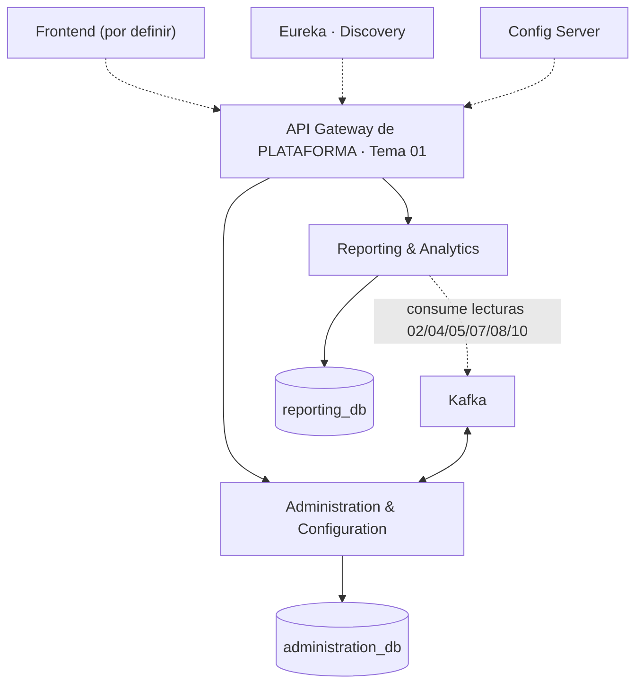

# Resumen visual

> **Frontend:** por definir.
> **Alcance:** **Tema 12 — Backoffice** según `TUP_PIV_BE_PROPUESTA_ARQ.pdf` (consumidor puro): administración de plataforma · proveedores de modelo (exclusiva ADMIN) · reportes docentes · panel del profesor · métricas CSAT · exportación · alertas.

## ¿Qué hace el Backoffice?

Backend administrativo de la plataforma con **2 servicios propietarios**; el resto lo **consume** (identidad/roles/auditoría del Tema 01, cohorte del Tema 02) o lo **lee** (contratos de lectura de 02/04/05/07/08/10). No implementa cursos, desafíos, usuarios ni economía.

## Arquitectura en una imagen

**Reglas no negociables:** gateway única puerta · registro dinámico · **toda llamada síncrona entre servicios pasa por el gateway** · base exclusiva por servicio · eventos por el bus.

## Los 2 servicios propietarios

| Servicio | Responsabilidad | Base |
|---|---|---|
| **Administration & Configuration** | PAR-01..24 + **proveedores/modelos de IA** (RF-IA-23/24/25/35) | administration_db |
| **Reporting & Analytics** | Reportes docentes, panel del profesor (alumno en riesgo), métricas CSAT, exportación, alertas | reporting_db |

## Consume (no implementa)

- **Tema 01**: identidad, auth, 2FA, roles, sesión, **auditoría**, retención, **API Gateway**.
- **Tema 02**: curso-cohorte (`course_id`), matrícula, pertenencia docente.
- **Lecturas** de los temas 02/04/05/07/08/10 para reportes/métricas (frescura ≤ 15 min, sin comparación entre docentes).

## Stack tecnológico

| Capa | Tecnología |
|---|---|
| Lenguaje / Framework | Java 21 · Spring Boot 3 |
| Build | Maven (multi-módulo) |
| Gateway | Spring Cloud Gateway (de plataforma, Tema 01) |
| Discovery | Eureka |
| Config | Spring Cloud Config Server |
| Mensajería | Kafka + Outbox (RabbitMQ = alternativa) |
| Persistencia | JPA/Hibernate · PostgreSQL (recomendada) |
| API docs | springdoc / OpenAPI 3 |
| Seguridad | Consume auth del Tema 01 (JWT + 2FA) |
| Pruebas | JUnit 5 · Mockito · Testcontainers · Spring Cloud Contract |

## Reglas críticas

- **Consumidor puro**: sin dominio propio; sin contratos de lectura en el sprint 1 no hay nada demostrable.
- **Proveedores de modelo exclusivos de ADMIN** (RF-IA-35) y auditados.
- Los **PAR** los administra el Backoffice, pero los **aplican** los Temas 03/05/08/10 (leen la configuración).
- Configuración **hacia adelante** (RF-CFG-06); encuestas solo **agregados anónimos** (RF-ENC-04).
- **Frescura ≤ 15 min**; **sin comparación entre docentes**.