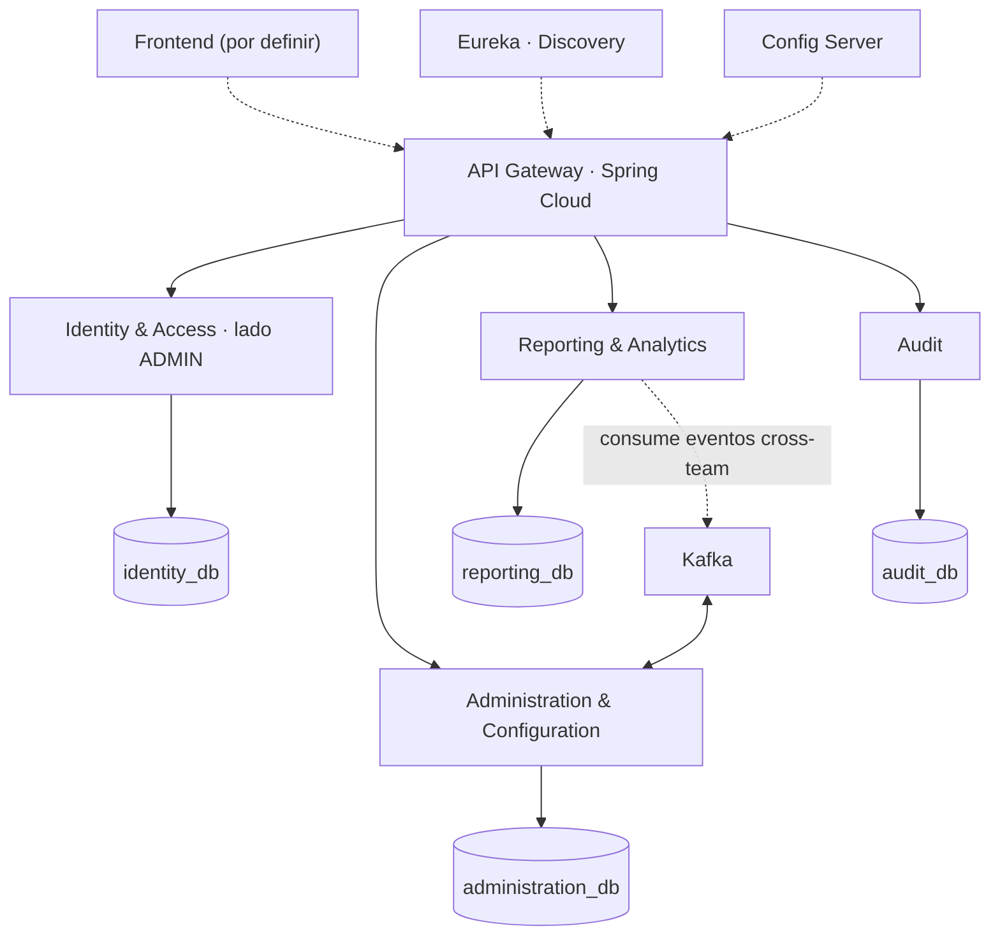

# Resumen visual

> **Frontend:** por definir. Este sitio cubre **backend y requerimientos**.
> **Alcance oficial del BackOffice:** administración de plataforma · gestión del proveedor de modelo (exclusiva ADMIN) · reportes docentes · panel de métricas de curso · exportación de datos.

## ¿Qué hace el BackOffice?

Backend administrativo para **ADMIN** y **PROFESOR**, con trazabilidad y seguridad. **No** implementa cursos, desafíos ni usuarios (equipos propios); los **consume** vía eventos para reportes y métricas.

## Arquitectura en una imagen

**Principios:** Database per Service · REST + eventos (Kafka) · Outbox · Idempotencia · Autorización en Gateway y en cada servicio · Correlation ID · Service Discovery (Eureka).

## Los 4 microservicios

| Servicio | Responsabilidad | Base |
|---|---|---|
| **Identity & Access** | Auth, 2FA, roles/permisos, gestión de ADMIN (último ADMIN, break-glass) | identity_db |
| **Administration & Configuration** | PAR-01..18 + **proveedores/modelos de IA** (RF-IA-23/24/25/35) | administration_db |
| **Reporting & Analytics** | Reportes docentes, métricas de curso, exportación | reporting_db |
| **Audit** | Registro inmutable de acciones administrativas | audit_db |

## Stack tecnológico

| Capa | Tecnología |
|---|---|
| Lenguaje / Framework | Java 21 · Spring Boot 3 |
| Build | Maven (multi-módulo) |
| Gateway | Spring Cloud Gateway |
| Discovery | Eureka (Consul = alternativa) |
| Config | Spring Cloud Config Server |
| Mensajería | Apache Kafka + Outbox (RabbitMQ = alternativa) |
| Persistencia | JPA/Hibernate · PostgreSQL (recomendada) |
| API docs | springdoc / OpenAPI 3 |
| Seguridad | Spring Security + JWT + 2FA (TOTP) |
| Pruebas | JUnit 5 · Mockito · Testcontainers · Spring Cloud Contract |

## Reglas críticas

- Nunca queda la plataforma **sin ADMIN activo** (incondicional, con concurrencia).
- Un ADMIN **no puede auto-eliminarse**; baja reforzada (contraseña + 2FA + confirmación escrita).
- **No existe hard delete** (baja lógica).
- Los cambios de configuración **rigen solo hacia adelante** (no se recalculan datos históricos).
- La **gestión de proveedores de modelo** es exclusiva de ADMIN (RF-IA-35).
- Las encuestas se consumen solo como **agregados anónimos** (RF-ENC-04).
- La auditoría es **inmutable** y separada de los logs técnicos.