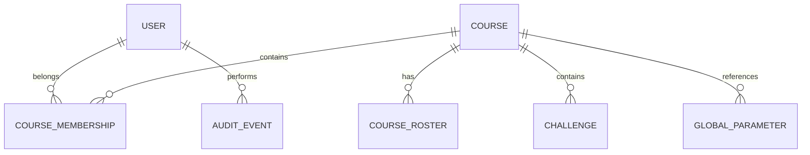

# Modelo de datos

> Database per Service. Modelo conceptual simplificado por dominio; las relaciones entre dominios se representan con IDs (sin FKs entre bases).

## Identity

```text
User
 ├── Id
 ├── FirstName
 ├── LastName
 ├── Legajo
 ├── Email
 ├── PasswordHash
 ├── Role            (ADMIN | PROFESOR | ALUMNO)
 ├── Status
 ├── TwoFactorEnabled
 └── CreatedAt
```

## Course

```text
Course
 ├── Id
 ├── Name
 ├── Description
 ├── OwnerUserId
 ├── Status          (DRAFT | ACTIVE | ARCHIVED)
 ├── CreatedAt
 └── ArchivedAt

CourseRoster
 ├── Id
 ├── CourseId        (tenant)
 ├── Legajo
 ├── Email
 └── Status

Challenge
 ├── Id
 ├── CourseId        (tenant)
 ├── Difficulty      (BASICO | MEDIO | AVANZADO)
 ├── Required
 ├── RetryCount
 └── Status
```

## Configuration

```text
GlobalParameter
 ├── Id
 ├── Key             (PAR-01..PAR-18)
 ├── Value
 ├── Version
 ├── UpdatedBy
 └── UpdatedAt
```

## Audit

```text
AuditEvent
 ├── Id
 ├── EventId
 ├── ActorId
 ├── ActorRole
 ├── Action
 ├── ResourceType
 ├── ResourceId
 ├── Timestamp
 ├── Result
 ├── Reason
 └── CorrelationId
```

## Reporting (read models)

```text
PlatformSnapshot / CourseSnapshot   ← derivados de eventos de otros servicios
```

## Relaciones principales (conceptuales)



## Reglas de datos transversales

- **Baja lógica** en toda producción académica: `deleted_at`, `deleted_by`, `deletion_reason`.
- **Encuestas:** dos registros desacoplados (marcador de cumplimiento por alumno + respuesta anónima) sin vínculo posible → se aplica en Reporting, no se reconstruye.
- **Retención:** 5 años desde el cierre; vencimiento → pendiente de decisión (extender / anonimizar); nunca purga automática.