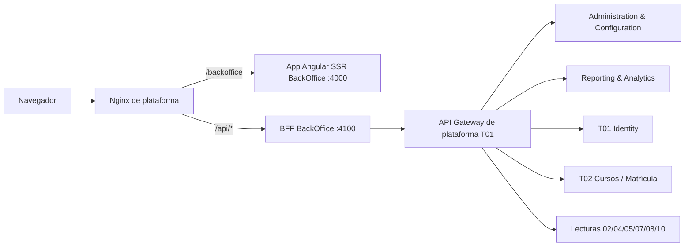

# Frontend BackOffice — Arquitectura y Despliegue

> **Plan definido** alineado a la consigna de Front (Unidad 1 — Arquitectura y Despliegue) y al plan de Back del módulo. Postura: **Caso A** (apps Angular SSR + Nginx, BFF por experiencia). El **BFF de BackOffice es del equipo BackOffice**; la app Angular + BFF + Nginx son de la materia **Front** y no suman microservicios de dominio al backend (el BackOffice sigue con 2 servicios propietarios).

## 1. Vista general



**Roles según la teoría de Front:**

- **Nginx = servidor web** (sirve el Angular compilado), **reverse proxy / gateway** (rutea `/api/*` al BFF), **deep-links** (fallback al index de cada app) y **headers de seguridad**.
- **BFF BackOffice** = el patrón *Backend for Frontend*: una sola respuesta por pantalla, agregando Reporting + Administration + T02.
- **Load balancing** con `upstream` solo cuando haya múltiples instancias (para el TP alcanza 1).

## 2. Conexiones con microservicios

El front **nunca habla directo con microservicios**: va al BFF → **API Gateway de plataforma (T01)**.

| Servicio | Qué usa la UI admin |
|---|---|
| **API Gateway (T01)** | Única puerta de `/api`; JWT/2FA, rate limiting, correlation ID |
| **Identity (T01)** | Login/logout, sesión (cookie httpOnly), roles, expiración (401 → login) |
| **Administration & Configuration (BackOffice)** | PAR-01..24 (editar config global), proveedores LLM, evaluador, golden set |
| **Reporting & Analytics (BackOffice)** | Panel, reportes docentes, métricas/CSAT, exportación, alertas |
| **Cursos / Matrícula (T02)** | Listar cursos (selector de tenant) y validar pertenencia |
| **Lecturas 02/04/05/07/08/10** | Solo si el panel lo requiere (ej. progreso, ranking, encuestas) |

**Importante:**
- **Kafka no toca al front**: los eventos de configuración van a consumidores backend. El front lee los PAR vía BFF → Administration (o en los datos del SSR).
- **Multitenancy en la UI**: selector de alcance — **curso puntual** o **todos los cursos** (`ALL`, caso ADMIN global). El BFF setea el contexto (`app.current_course`) desde la sesión validada; el front nunca manda un `course_id` suelto.

## 3. Nginx — config de ejemplo

```nginx
server {
    listen 80;
    server_name plataforma.edu.ar;

    # Seguridad
    add_header X-Content-Type-Options nosniff always;
    add_header Strict-Transport-Security "max-age=31536000" always;
    # CSP acotada a la app BackOffice

    # Web server: BackOffice (SSR)
    location /backoffice/ {
        proxy_pass http://backoffice-ssr:4000;
        proxy_set_header Host $host;
        proxy_set_header X-Real-IP $remote_addr;
    }

    # Deep-link fallback (regla de oro: el index DE ESA app)
    location /backoffice/ {
        try_files $uri $uri/ /backoffice/index.html;
    }

    # Cache: index.html no-cache; assets con hash inmutables
    location /backoffice/assets/ {
        expires 1y;
        add_header Cache-Control "public, immutable";
    }

    # Reverse proxy → BFF BackOffice (única puerta de API)
    location /api/ {
        proxy_pass ${BFF_URL};
        proxy_set_header Host $host;
        proxy_set_header X-Real-IP $remote_addr;
    }
}
```

> El `location /api/` es el *reverse proxy* de la teoría: intercepta las llamadas de API antes de llegar al bloque `/` y las reenvía al BFF, conservando la IP/host del cliente (logs, trazabilidad, rate limiting).

## 4. Docker — build en dos etapas + configuración dinámica

**Dockerfile** (igual al patrón de la consigna: compilar en Node, servir con Nginx):

```dockerfile
FROM node:20 AS build
WORKDIR /app
COPY . .
RUN npm install && npm run build

FROM nginx:alpine
COPY --from=build /app/dist/backoffice /usr/share/nginx/html
COPY nginx.conf.template /etc/nginx/templates/nginx.conf.template
```

**Config dinámica con `envsubst`**: el `nginx.conf.template` lleva `${BFF_URL}` sin resolver; al arrancar el contenedor, `envsubst` la completa con la variable de entorno. **La misma imagen sirve staging y producción** sin recompilar (el problema que resuelve la teoría).

```nginx
# nginx.conf.template (fragmento)
location /api/ {
    proxy_pass ${BFF_URL};
}
```

```bash
# arranque del contenedor
envsubst < /etc/nginx/templates/nginx.conf.template > /etc/nginx/conf.d/default.conf
nginx -g 'daemon off;'
```

**docker-compose** (el frontend es el único punto visible; el BFF queda dentro de la red interna):

```yaml
services:
  frontend-backoffice:
    build: ./frontend-backoffice
    ports:
      - "8080:80"
    environment:
      BFF_URL: http://bff-backoffice:4100
    depends_on:
      bff-backoffice:
        condition: service_healthy
  bff-backoffice:
    build: ./bff-backoffice
    expose:
      - "4100"
    healthcheck:
      test: ["CMD", "curl", "-f", "http://localhost:4100/health"]
      interval: 10s
      timeout: 5s
      retries: 5
```

> `depends_on` con `service_healthy` evita arrancar Nginx antes de que el BFF responda (la consigna advierte que `depends_on` simple no espera la *disponibilidad*).

## 5. Load balancing (cuando haya varias instancias)

```nginx
upstream bff_backend {
    least_conn;
    server bff-backoffice-1:4100;
    server bff-backoffice-2:4100;
}
location /api/ {
    proxy_pass http://bff_backend/;
}
```

**Algoritmos disponibles en Nginx** (los mismos de la consigna):

| Algoritmo | Directiva | Cómo elige la instancia | Cuándo conviene |
|---|---|---|---|
| **Round Robin** | (por defecto) | Reparte en orden circular, una a cada instancia por turno | Instancias con capacidad similar y solicitudes parejas |
| **Weighted Round Robin** | `server host weight=3;` | Las instancias con mayor `weight` reciben una proporción mayor | Instancias con distinta capacidad de cómputo |
| **Least Connections** | `least_conn;` | Envía a la instancia con **menos conexiones activas** | Carga despareja o solicitudes con tiempos muy distintos |
| **IP Hash** | `ip_hash;` | Asigna cada cliente **siempre a la misma instancia** según su IP | Hace falta mantener sesiones/estado temporal (sticky sessions) |

Nginx además **detecta instancias que dejan de responder** y las retira del grupo hasta que vuelven (por fallos de conexión; para health checks de aplicación se usa un orquestador o healthchecks activos). Para el TP con ~450 usuarios y ~la mitad activos alcanza **1 instancia**; la configuración queda documentada para escalar.

## 6. Despliegue: estrategias evaluadas

La consigna presenta seis estrategias. Elegimos la combinación que mejor equilibra **riesgo y costo** para el TP:

| Estrategia | Qué hace | Nuestra decisión |
|---|---|---|
| **Rolling Update** | Reemplaza las instancias de a poco (viejas y nuevas conviven durante la ventana) | ✅ **Base** — no duplica infraestructura; exige que las versiones convivan sin romper contratos |
| **Feature Flags** | Activa/desactiva una funcionalidad dentro de la **misma versión**, sin re-deploy | ✅ **Complemento** — separa "desplegar código" de "activar funcionalidad" |
| **Blue-Green** | Dos entornos idénticos; Nginx conmuta el tráfico entre ellos | ⚠️ **Alternativa** — garantiza cero downtime y rollback casi instantáneo, a costa de duplicar infraestructura |
| **Canary** | Libera a un % chico del tráfico y avanza según métricas | ❌ **Descartado** — exige balanceo por porcentaje y monitoreo en tiempo real que el TP no justifica |
| **A/B Testing** | Compara **negocio/UX** (qué variante conviene), no estabilidad | ❌ **Descartado** — no comparamos variantes de producto en este módulo |
| **Shadow** | Duplica el tráfico real a la versión nueva **descartando la respuesta** | ❌ **Descartado** — duplicar tráfico sin duplicar efectos es complejo y riesgoso en operaciones no idempotentes |

### 6.1 Herramientas del despliegue (alineadas a la consigna)

| Categoría | Qué resuelve | Nuestra postura |
|---|---|---|
| **Infraestructura e inmutabilidad** | Crear y reproducir la infraestructura de forma confiable | **Imagen inmutable por release** (Docker Compose): se construye una imagen nueva y se reemplaza el servidor entero, sin config que funciona en un entorno y en otro no. Terraform/Ansible solo si sobra tiempo |
| **Pipelines de CI/CD** | Automatizar build, testing y despliegue en cada cambio | **GitHub Actions** (el mismo que ya usa el sitio): git push → build 2 etapas → tests → push de imagen → deploy del compose |
| **Secretos y configuración** | Mantener credenciales fuera del código fuente | Variables de entorno vía **`envsubst`**; nunca URLs/credenciales hardcodeadas en `nginx.conf` ni en el repo |
| **Monitoreo y rollback** | Detectar anomalías y decidir si la versión sigue o se revierte | **healthchecks** (`service_healthy`), **logs de Nginx**, versionado por **tag** para revertir; Prometheus/Grafana opcional |

**Qué NO se hace:** el front no habla con la base ni con Kafka; el BFF no contiene reglas de negocio; no se implementan otras experiencias (Alumno/Profesor).

> Detalle técnico completo en el SDD (`sdd/frontend/docs/09-despliegue.md`) y en las tareas de front del módulo.