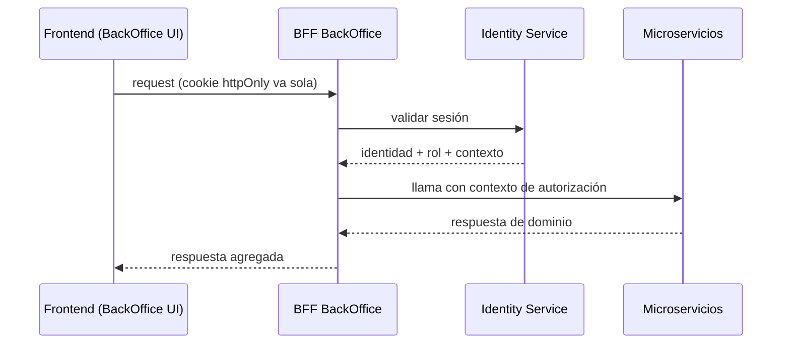

# Frontend — Plan de Comunicación (Caso A)

> Postura confirmada: **Caso A** (apps Angular SSR por dominio + Nginx). Plan con decisiones; detalle en `frontend_plan_comunicacion.md`.

## Decisiones base

| Decisión | Elección |
|---|---|
| Integración | Caso A — apps Angular SSR en multirepos |
| BFF | **Uno por experiencia** (BackOffice, Alumno, Profesor) |
| Compartir estado | Custom Events + Storage (sin store global) |
| Sesión | Cookie httpOnly en dominio compartido (propiedad de Identity) |
| UI | Librería `@tup/ui` (tokens + componentes) |
| Entrada | Nginx (reverse proxy + enrutador) |

## Frontend → BFF → microservicios



El **BFF de BackOffice es del equipo BackOffice**: recibe la cookie, valida en Identity, agrega respuestas para la pantalla y sirve datos al SSR. No almacena reglas de negocio.

## Compartir información entre frontends

- **Custom Events** (concepto): `auth:logout`, `auth:session-expired`, `data:changed`. Notificaciones, no fuente de verdad.
- **Storage**: solo preferencias no sensibles (mismo origen). Nunca tokens (XSS).
- **Store global cross-app: no.** Servidor = fuente de verdad.

## Sesión, login y logout

- Cookie **httpOnly + Secure + SameSite** con dominio compartido → viaja sola a todas las apps.
- **Login único** + 2FA; **logout** invalida sesión + borra cookie + evento `auth:logout`.
- **Expiración:** 401 del BFF → redirect a login conservando el intento + `auth:session-expired`.
- **Propiedad:** la define el equipo BackOffice (Identity). El front solo la consume.

## UI compartida `@tup/ui`

Design tokens (variables CSS) + componentes; semver (breaking → major); consumo solo desde la librería; check en CI.

## Nginx — entrada y enrutador

| Ruta | Destino |
|---|---|
| `/` | App Alumno / landing (SSR) |
| `/profesor` | App Profesor (SSR) |
| `/backoffice` | App BackOffice (SSR) |
| `/api/*` | BFF / Gateway |

TLS, SSR + assets, headers de seguridad (CSP/HSTS), compresión/cache, **degradación controlada** si una app cae.

## Peticiones duplicadas y manejo de 429

### Frontend — patrón single-flight (request dedup)

En el interceptor HTTP: si ya hay una petición **idéntica en vuelo** (método + URL + body), las siguientes **se unen a la misma promesa** en vez de disparar otra.

```text
Petición (método+URL+body)
   ¿existe idéntica EN VUELO?
   ├── Sí → unirse a la misma promesa
   └── No → disparar; liberar clave al completar
```

- Evita doble submit (Crear curso, Guardar configuración, Importar padrón).
- Complemento UX: botones deshabilitados / estados de carga.

### Manejo de 429

- Leer **`Retry-After`** y esperar (backoff con jitter) antes de reintentar.
- **No** reintentar automáticamente operaciones no idempotentes.
- Mensaje claro al usuario.
- El BFF puede coalescer peticiones idénticas (segunda barrera).

### Backend — rate limiting

- Rate limiting en **Gateway** (Spring Cloud Gateway + **Bucket4j** in-memory o **Redis RequestRateLimiter**).
- Umbrales por endpoint/rol; foco en `/login`, `/api/auth/*`, `/api/audit`.
- Respuesta **429** con `Retry-After` + **Idempotency Keys** en operaciones críticas (PUT config, baja ADMIN).

## Marketplace de plugins TUP + agentes de IA (conceptual)

| Capacidad | Qué implica |
|---|---|
| Publicar | Manifesto (id, versión, autor, permisos), SDK del agente |
| Versionar | Semver, versiones inmutables, canales stable/beta |
| Descubrir | Catálogo, búsqueda por agente/capacidad, trust score |
| Instalar/actualizar | Dependencias, compatibilidad, rollback |
| Validar | Análisis estático, sandbox, esquema de **tools (MCP)**, firma/checksums |
| Seguridad | Least privilege, aprobación del usuario, cuotas, auditoría |

Agentes objetivo: Claude, Codex, OpenCode, Gemini, Copilot. El plugin expone un contrato de herramientas (idealmente **MCP**) que el agente invoca con entradas/salidas tipadas.