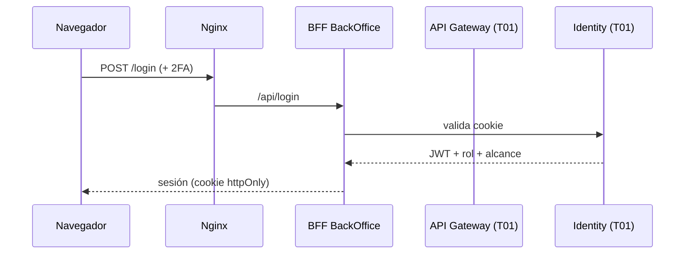
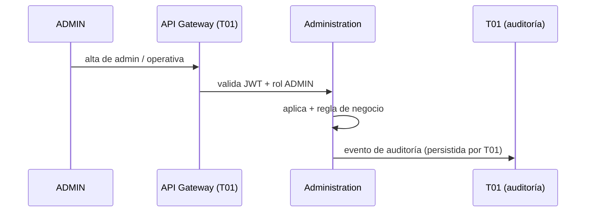
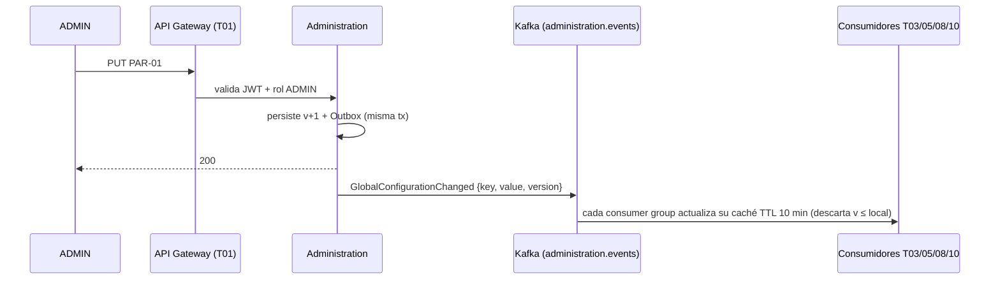
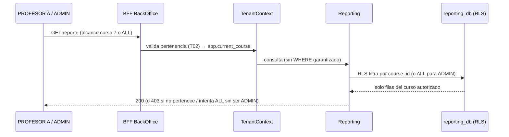
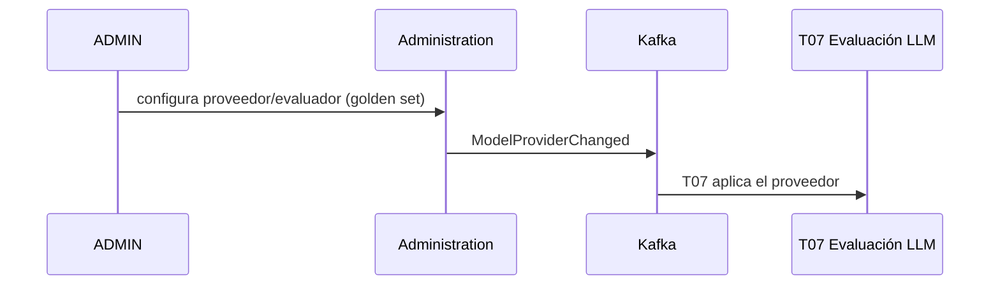
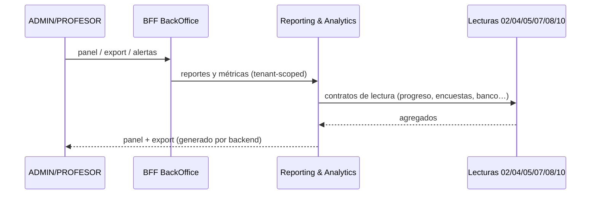

# Flujos de trabajo y casos de uso (TPI)

> **Para la clase:** cada grupo muestra cómo se conecta su parte con los demás componentes. Estos son los flujos del **BackOffice (Tema 12)**, con su conexión a otros equipos. Demo en vivo: [Sección interactiva](/interactivo/).

## Caso 1 — Login y sesión (Front → BFF → Identity)

**Conecta con:** **T01 Identity** (login, 2FA, roles, sesión).

## Caso 2 — Alta de administrador / gestión de plataforma

**Conecta con:** **T01** (roles, auditoría). Ver tarea [Administración de plataforma](/msii/tareas/administracion-plataforma).

## Caso 3 — Cambio de configuración global (PAR-01) — Kafka + caché

**Conecta con:** **T03/05/08/10** (aplican la configuración hacia adelante, RF-CFG-06). Demo: [Interactivo](/interactivo/flujo-config).

## Caso 4 — Reporte por curso (multitenancy + RLS) y caso ADMIN

**Conecta con:** **T02 Matrícula** (pertenencia), **Reporting** (tenant-scoped). Demo: [Interactivo](/interactivo/multitenancy-rls).

## Caso 5 — Gestión del proveedor LLM (exclusivo ADMIN)

**Conecta con:** **T07** (consume el proveedor). Ver tarea [Proveedor LLM](/msii/tareas/proveedor-llm).

## Caso 6 — Panel, exportación y alertas (Reporting)

**Conecta con:** lecturas de **T02/04/05/07/08/10** (contratos de lectura). Ver tarea [Reportes docentes](/msii/tareas/reportes-docentes).

---

> Todos los flujos respetan: sync por el **API Gateway (T01)** (regla no negociable), asíncrono por **Kafka** con **Outbox + idempotencia**, y **multitenancy + RLS** en el reporting.