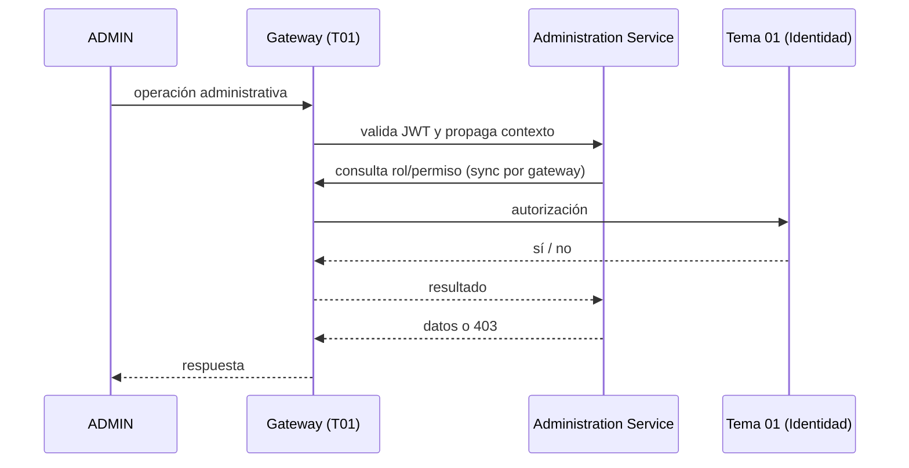

# Tarea 1 — Administración de plataforma

> **Sprint 1 · Talla M · ~4 persona-días** · RF-CFG-01/05

## 1. Objetivo
Proveer la base operativa para que el ADMIN administre la plataforma: operar sobre la configuración global y el proveedor de modelo, con autorización centralizada consumiendo identidad del **Tema 01** y sin acceder a dominios de otros temas.

## 2. Alcance
- **In:** operaciones administrativas de ADMIN sobre configuración y proveedores; permisos de endpoints; trazabilidad (correlation ID + auditoría emitida al T01); base del panel administrativo (lecturas).
- **Out:** NO implementa identidad/auth/roles/2FA (Tema 01); NO administra cursos, desafíos, usuarios ni economía.

## 3. Requerimientos vinculados
RF-CFG-01 (config global admin), RF-CFG-05 (separación de ámbitos), RF-ROL-* (consumidos: roles), RF-IA-ADM-01 (proveedor exclusivo ADMIN).

## 4. Diseño técnico
- **Arquitectura:** Clean Architecture (`api → application → domain ← infrastructure`) en `administration-service`.
- **Autorización:** el gateway (T01) valida el token y propaga contexto; el servicio consulta rol/permiso a T01 por el gateway (*validar ≠ autorizar*).
- **Seguridad:** JWT (T01), rate limiting en gateway (429 con `Retry-After`), Idempotency-Key en operaciones críticas, secretos por variables de entorno.
- **Observabilidad:** correlation ID propagado, logs estructurados, health checks.
- **Eventos:** auditoría de acciones administrativas **emitida** al T01.

## 5. Contrato API
| Endpoint | Método | Roles | Alcance |
|---|---|---|---|
| `/api/administration/parameters*` | GET/PUT | ADMIN (PROFESOR lectura) | global |
| `/api/administration/model-providers*` | CRUD | ADMIN | exclusivo ADMIN |

## 6. Modelo de datos
`GlobalParameter` (ver Tarea 2) · `ModelProvider` (ver Tarea 3). No se crean entidades de identidad (T01).

## 7. Reglas de negocio
- Solo ADMIN configura globalmente (RF-CFG-05).
- La baja/cambios de ADMIN y auditoría las resuelve el T01.
- Toda llamada síncrona entre servicios pasa por el gateway.

## 8. Plan de implementación
| Paso | Subtarea | Días |
|---|---|---|
| 1 | Consumo de auth/roles (cliente a T01 por el gateway) + contexto de usuario | 1 |
| 2 | Permisos de endpoints administrativos (filtro de autorización) | 1 |
| 3 | Operativa ADMIN base sobre configuración/proveedores (endpoints + DTOs + validación) | 1.5 |
| 4 | Observabilidad + auditoría emitida a T01 + tests | 0.5 |

## 9. Pruebas
Unitarias (autorización, DTOs) · integración (MockMvc + Testcontainers, flujo admin) · contract (gateway→servicio).

## 10. Criterios de aceptación (DoD)
- [ ] Endpoints administrativos protegidos (solo ADMIN) y con alcance validado.
- [ ] Auditoría emitida al T01 en acciones sensibles.
- [ ] Rate limiting + Idempotency-Key operativos.
- [ ] Tests unit + integración verdes; Swagger documentado.

## 11. Riesgos y dependencias
Depende de T01 (auth/roles). Riesgo: cambios en el contrato de token/roles del T01 → mitigación: adapter al cliente de identidad.