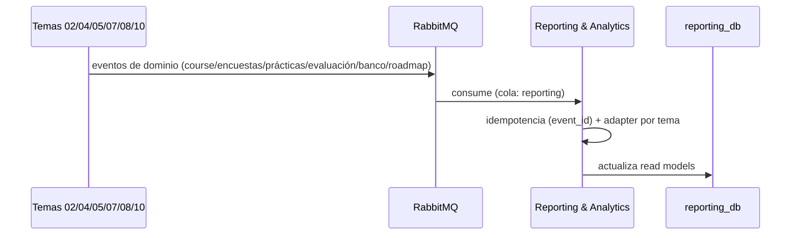

# Tarea 4 — Contratos de lectura con los seis temas

> **Sprint 1 · Talla L · ~7 persona-días** · RF-RPT-10

## 1. Objetivo
Acordar y consumir los **contratos de lectura** con los seis temas que proveen datos al Backoffice (02 Cursos/Matrícula, 04 Teóricos/Encuestas, 05 Prácticos, 07 Evaluación LLM, 08 Banco, 10 Roadmap). Es la **dependencia crítica del sprint 1**: *"sin contratos de lectura acordados no hay nada demostrable"* (consumidor puro).

## 2. Alcance
- **In:** definición de contratos (eventos/APIs), suscripción, adapters de lectura, read models base.
- **Out:** NO es dueño de los datos; NO accede a las bases de otros temas (solo eventos/APIs por el gateway); no implementa dominio ajeno.

## 3. Requerimientos vinculados
RF-RPT-10 · RF-REP-01/03 · regla "cada entidad tiene un único dueño".

## 4. Diseño técnico
- **Arquitectura:** `reporting-service`, Clean Architecture.
- **Patrón:** Adapter (un cliente por tema, aisla el contrato) + Consumer idempotente (Outbox/`event_id`).
- **Comunicación:** asíncrona por RabbitMQ (temas publican, Reporting consume con su cola) y síncrona por el gateway cuando haga falta (ej. pertenencia a cohorte → T02).
- **Frescura:** los read models se actualizan vía eventos (base para la Should de frescura ≤15 min).
- **Contrato:** envelope estándar `{eventId, eventType, occurredAt, correlationId, actorId, source, payload}` + `ProcessedEvent` para idempotencia.

## 5. Contrato API (de lectura)
| Tema | Datos que provee | Mecanismo |
|---|---|---|
| 02 Cursos/Matrícula | cohorte, matrícula, pertenencia docente | evento + API (gateway) |
| 04 Teóricos/Encuestas | agregados de encuestas (anónimos) | evento |
| 05 Prácticos | entregas, resultados | evento |
| 07 Evaluación LLM | estado de calibración/drift, scores | evento |
| 08 Banco | saldos, movimientos | evento |
| 10 Roadmap | progreso, XP, niveles | evento |

## 6. Modelo de datos
Read models en `reporting_db`: `CohortMetricsSnapshot`, `TeacherReportSnapshot`, `ConfigurationSnapshot`, `ModelProviderSnapshot` (jsonb, reconstruibles por replay).

## 7. Reglas de negocio
- No acceder a bases de otros temas (solo eventos/APIs por el gateway).
- **Encuestas: solo agregados anónimos** (RF-ENC-04/12).
- Contratos **versionados**: un cambio de productor no rompe consumidores.

## 8. Plan de implementación
| Paso | Subtarea | Días |
|---|---|---|
| 1 | Acuerdo de contratos con los 6 temas (sesión de integración) + definición de topics | 2 |
| 2 | Suscripción + colas + idempotencia | 2 |
| 3 | Adapters por tema + read models base | 2.5 |
| 4 | Contract testing del envelope + tests | 0.5 |

## 9. Pruebas
Integración (Testcontainers RabbitMQ) · contract testing de eventos (productor↔consumidor) · multitenancy por `course_id`.

## 10. Criterios de aceptación (DoD)
- [ ] Contratos acordados y documentados (topics + payloads versionados).
- [ ] Consumidores idempotentes (event_id) y con Outbox del productor.
- [ ] Read models base construidos sin acceder a bases ajenas.
- [ ] Encuestas solo agregados anónimos; tests de integración verdes.

## 11. Riesgos y dependencias
Es la dependencia **más riesgosa**: si los 6 temas no exponen lecturas, el Backoffice no tiene nada demostrable (consumidor puro). Mitigación: acordar contratos en el sprint 1 (sesión de integración) y definir contract testing temprano.