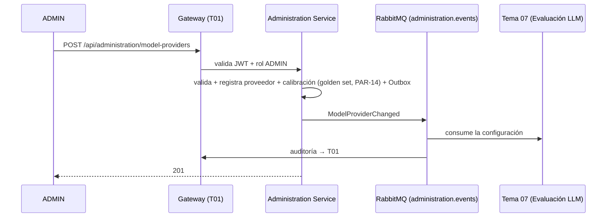

# Tarea 3 — Gestión del proveedor LLM (exclusiva de ADMIN)

> **Sprint 1 · Talla L · ~8 persona-días** · RF-IA-ADM-01..07 (RF-IA-23/24/25/28/31/32/35)

## 1. Objetivo
Permitir al ADMIN **exclusivamente** administrar los proveedores y modelos de LLM de la plataforma: alta/sustitución/baja, asignación modelo↔función, evaluador único activo, golden set base + calibración y detección de deriva. El **Tema 07 (Evaluación LLM)** consume esta configuración.

## 2. Alcance
- **In:** CRUD de proveedores, asignación modelo↔función (TUTOR/EVALUATOR/MODERATOR/GENERATOR/RAG), configuración del evaluador (único activo, cambio con calibración), golden set base + calibración (PAR-14), detección de deriva, evento `ModelProviderChanged`, auditoría emitida a T01.
- **Out:** NO invoca LLMs (T07); NO es dueño de rúbricas de evaluación (T07) más allá del golden set a nivel plataforma.

## 3. Requerimientos vinculados
RF-IA-35 (alta/baja proveedores, exclusiva ADMIN, auditada) · RF-IA-23/24 (modelo↔función global) · RF-IA-25 (evaluador único) · RF-IA-28 (cambio evaluador) · RF-IA-30/31 (golden set + calibración) · RF-IA-32 (deriva).

## 4. Diseño técnico
- **Arquitectura:** `administration-service`, Clean Architecture.
- **Patrón:** Command (`RegisterModelProviderCommand`, `AssignModelToFunctionCommand`) + Specification (reglas de cambio de evaluador/calibración) + Adapter (cliente al T07 para validar consumo).
- **Datos:** `ModelProvider`, `ModelFunctionAssignment`, `EvaluatorConfig`, `GoldenSet` (value jsonb).
- **Consistencia:** cambio + Outbox en la misma transacción → `ModelProviderChanged`.
- **Seguridad:** exclusivo ADMIN (RF-IA-35), auditado (evento a T01), Idempotency-Key en alta/baja.

## 5. Contrato API
| Endpoint | Método | Roles | Notas |
|---|---|---|---|
| `/api/administration/model-providers` | GET/POST | ADMIN | exclusivo ADMIN |
| `/api/administration/model-providers/{id}` | PUT/DELETE | ADMIN | baja lógica |
| `/api/administration/model-functions/{function}` | PUT | ADMIN | asignación modelo↔función |
| `/api/administration/evaluator/activate` | POST | ADMIN | activa evaluador con calibración aprobada |
| `/api/administration/evaluator/calibration` | GET | ADMIN | estado de calibración/drift |

## 6. Modelo de datos
`ModelProvider` (name, status ACTIVE/RETIRED, audit) · `ModelFunctionAssignment` (function, model_id, model_version) · `EvaluatorConfig` (model único, rubric_version, status PENDING_CALIBRATION/ACTIVE/RETIRED) · `GoldenSet` (version, entries jsonb, tolerance_ok).

## 7. Reglas de negocio
- Potestad **exclusiva de ADMIN** (RF-IA-35) y auditada (quién, cuándo, qué modelo, para qué función).
- **Evaluador único activo** (RF-IA-25); cambio exige calibración dentro de PAR-14 (RF-IA-31), sin override.
- Detección de deriva (RF-IA-32): re-calibración periódica/ante cambio de versión; fuera de tolerancia → alerta al ADMIN.

## 8. Plan de implementación
| Paso | Subtarea | Días |
|---|---|---|
| 1 | CRUD proveedores + migración Flyway | 2 |
| 2 | Asignación modelo↔función (4 funciones + evaluador único) | 2 |
| 3 | Golden set base + calibración (tolerancia PAR-14) + evaluador activo | 2.5 |
| 4 | Detección de deriva + evento `ModelProviderChanged` + auditoría + tests | 1.5 |

## 9. Pruebas
Unitarias (exclusividad ADMIN, evaluador único, calibración) · integración (Testcontainers: persistencia + RabbitMQ + golden set) · contract del evento con T07.

## 10. Criterios de aceptación (DoD)
- [ ] CRUD de proveedores exclusivo ADMIN y auditado.
- [ ] Evaluador único activo; no se activa sin calibración dentro de PAR-14 (sin override).
- [ ] `ModelProviderChanged` publicado (envelope estándar) y consumido por T07.
- [ ] Deriva detectada → alerta; tests verdes; Swagger.

## 11. Riesgos y dependencias
Depende de T07 (consume la config) y del golden set (dependencia de contenido docente, no de desarrollo — señalada en el doc del profe). Riesgo: proveedor caído/cuota → se mitiga con la degradación del PRD (RF-IA-27) que implementa T07.