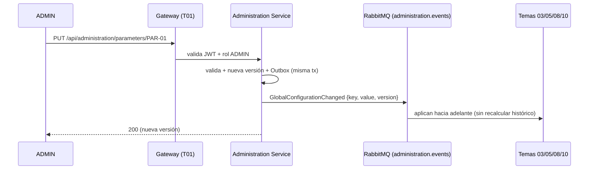

# Tarea 2 — Registro de parámetros PAR-01..24

> **Sprint 1 · Talla M · ~4 persona-días** · RF-CFG-04/06

## 1. Objetivo
Exponer el catálogo global de parámetros de economía y operativos (**PAR-01..PAR-24**, base PRD PAR-01..18 con registro extensible) que el ADMIN configura y los Temas 03/05/08/10 **leen** para aplicar la economía, con versionado y cambios **solo hacia adelante** (RF-CFG-06).

## 2. Alcance
- **In:** CRUD de `GlobalParameter`, versionado, regla de hacia adelante, evento `GlobalConfigurationChanged`, autorización ADMIN.
- **Out:** NO calcula XP/monedas (lo hacen T08/T10); NO es dueño de saldos.

## 3. Requerimientos vinculados
RF-CFG-04 (economía global, solo ADMIN), RF-CFG-05 (ámbitos), RF-CFG-06 (hacia adelante).

## 4. Diseño técnico
- **Arquitectura:** `administration-service`, Clean Architecture.
- **Patrón:** Command (`UpdateParameterCommand`) + Specification de permisos (ADMIN).
- **Versionado:** columna `version`; cada cambio crea una versión; el valor es JSON (`jsonb`) → extensible a cualquier parámetro.
- **Consistencia:** cambio + `OutboxMessage` en la misma transacción (Unit of Work) → evento `GlobalConfigurationChanged` (envelope estándar) consumido por Temas 03/05/08/10.
- **Idempotencia:** `Idempotency-Key` en PUT para evitar duplicados.
- **Propagación híbrida (RabbitMQ + caché):** cambio + `OutboxMessage` en la misma transacción → `GlobalConfigurationChanged` por el exchange `administration.events`; cada consumidor (Temas 03/05/08/10) mantiene **caché local con TTL 10 min** (versión + valor) que el evento invalida antes; respaldo ante caída del Backoffice (sirve el último valor conocido).



## 5. Contrato API
| Endpoint | Método | Roles | Notas |
|---|---|---|---|
| `/api/administration/parameters` | GET | ADMIN, PROFESOR | PROFESOR: solo lectura |
| `/api/administration/parameters/{key}` | GET | ADMIN, PROFESOR | solo lectura |
| `/api/administration/parameters/{key}` | PUT | ADMIN | Idempotency-Key; crea versión |

## 6. Modelo de datos
```text
GlobalParameter
 ├── id (UUID)
 ├── key (varchar)        ← PAR-01..PAR-24
 ├── value (jsonb)        ← valor versionado
 ├── version (int)        ← incrementa por cambio
 ├── updated_by (UUID)    ← FK lógica → T01
 └── updated_at (timestamp)
```
Migración Flyway `V1__global_parameter.sql`.

## 7. Reglas de negocio
- Solo ADMIN modifica (RF-CFG-05). PROFESOR solo lectura.
- Un cambio **nunca recalcula** XP/monedas históricos (RF-CFG-06).
- El registro es genérico: no depende de la cantidad de parámetros (18 del PRD, 24 mencionados por el profe).

## 8. Plan de implementación
| Paso | Subtarea | Días |
|---|---|---|
| 1 | Entidad + migración Flyway + repositorio | 1 |
| 2 | Command + endpoint GET/PUT + DTOs + validación | 1 |
| 3 | Versionado + regla hacia adelante + Specification permisos | 1 |
| 4 | Evento `GlobalConfigurationChanged` + Outbox + tests | 1 |

## 9. Pruebas
Unitarias (versionado, hacia adelante, permisos) · integración (Testcontainers: persistencia + RabbitMQ publish + Outbox).

## 10. Criterios de aceptación (DoD)
- [ ] CRUD de parámetros funcional; PUT incrementa versión.
- [ ] Cambio hacia adelante verificado (no se recalculan históricos).
- [ ] `GlobalConfigurationChanged` publicado con envelope estándar e idempotencia.
- [ ] Solo ADMIN escribe; tests unit + integración verdes; Swagger.

## 11. Riesgos y dependencias
Depende de la lectura de los Temas 03/05/08/10 (deben consumir el evento y NO hardcodear PAR). Riesgo: cambio de contrato del evento → contrato versionado.