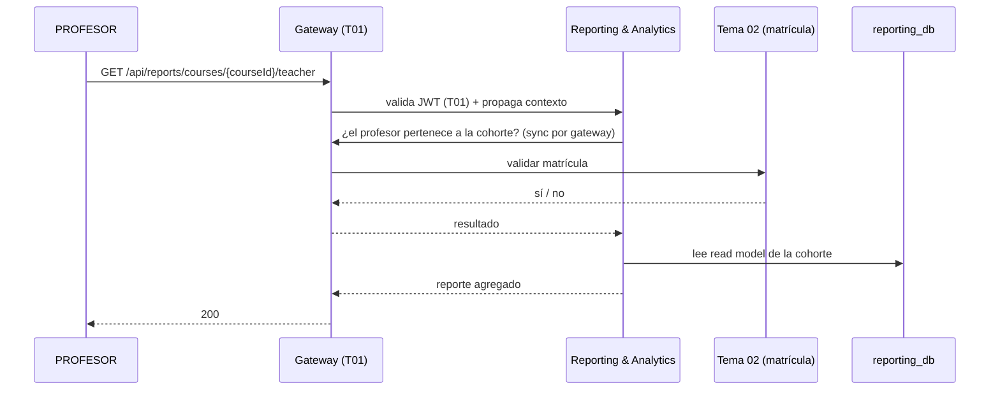

# Tarea 5 — Reportes docentes

> **Sprint 1 · Talla M · ~5 persona-días** · RF-RPT-01

## 1. Objetivo
Proveer **reportes docentes** por cohorte: el PROFESOR consulta reportes de sus cohortes y el ADMIN el consolidado de plataforma con desglose por curso, alimentados por los **read models** de los contratos de lectura (Tarea 4). Se respeta el alcance por matrícula (T02) y **sin comparación entre docentes**.

## 2. Alcance
- **In:** endpoints de reportes docentes, autorización por matrícula, agregación por cohorte.
- **Out:** NO incluye el panel de alumno en riesgo, KPIs CSAT ni exportación (son Should/Could); solo el reporte docente base.

## 3. Requerimientos vinculados
RF-RPT-01 · RF-REP-02/03 · RF-RPT-08 (no exposición fuera de ámbito).

## 4. Diseño técnico
- **Arquitectura:** `reporting-service`, Clean Architecture; CQRS (lectura por query/handler).
- **Autorización:** el alcance del PROFESOR se valida contra la **matrícula del T02** (cross-team, por el gateway); *validar ≠ autorizar*.
- **Datos:** read models (`TeacherReportSnapshot`, `CohortMetricsSnapshot`) reconstruidos por replay de Kafka.
- **Observabilidad:** correlation ID, logs; **sin comparación entre docentes** (cada docente ve solo sus cohortes).

## 5. Contrato API
| Endpoint | Método | Roles | Alcance |
|---|---|---|---|
| `/api/reports/platform` | GET | ADMIN | global |
| `/api/reports/courses/{courseId}` | GET | ADMIN, PROFESOR | PROFESOR: su cohorte |
| `/api/reports/courses/{courseId}/teacher` | GET | PROFESOR, ADMIN | PROFESOR: su cohorte |

## 6. Modelo de datos
Read models en `reporting_db`: `TeacherReportSnapshot` (course_id, teacher_id, resumen agregado), `CohortMetricsSnapshot` (course_id, métricas base).

## 7. Reglas de negocio
- PROFESOR solo ve sus cohortes (matrícula T02).
- **Sin comparación entre docentes** (no se expone ranking/cruce entre docentes).
- Solo agregados; encuestas anónimas (RF-ENC-04/12) cuando el reporte las incluya.
- **Multitenancy (TenantContext + RLS):** los read models se acotan por `course_id` (tenant = curso-cohorte); el `TenantContext` setea `app.current_course` desde el contexto validado y **nunca confía en el `course_id` del request**; **RLS** de PostgreSQL refuerza el aislamiento a nivel de base (no reemplaza la autorización).

## 8. Plan de implementación
| Paso | Subtarea | Días |
|---|---|---|
| 1 | Query handler + DTOs de reporte | 1 |
| 2 | Validación de matrícula (cliente a T02 por el gateway) | 1.5 |
| 3 | Endpoints + agregación por cohorte (ADMIN/PROFESOR) | 1.5 |
| 4 | Tests + Swagger | 1 |

## 9. Pruebas
Unitarias (alcance, agregación) · integración (MockMvc + Testcontainers, matrícula T02 mockeada) · **multitenancy obligatorio: PROFESOR A → cohorte A → 200; PROFESOR A → cohorte B → 403** (+ verificación de RLS en la base).

## 10. Criterios de aceptación (DoD)
- [ ] PROFESOR ve solo sus cohortes (403 si no pertenece).
- [ ] ADMIN ve consolidado y desglose por curso.
- [ ] Sin comparación entre docentes verificada.
- [ ] Tests verdes; Swagger documentado.

## 11. Riesgos y dependencias
Depende de la **Tarea 4** (contratos de lectura) y de T02 (matrícula). Riesgo: si T02 no expone la pertenencia, no se puede autorizar el reporte → mitigar con contrato acordado en sprint 1.