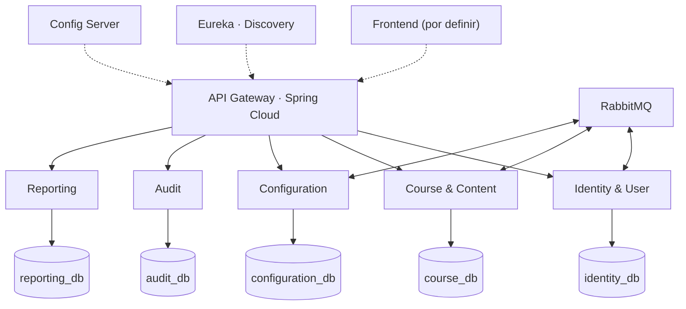

# Resumen visual

> **Frontend:** por definir. Este sitio cubre **backend y requerimientos**. El frontend consumirá la API a través del Gateway cuando los docentes definan la arquitectura.

## ¿Qué hace el BackOffice?

Backend administrativo para **ADMIN** y **PROFESOR**, con trazabilidad y seguridad.

| Rol | Qué puede hacer | Alcance |
|---|---|---|
| **ADMIN** | Todo, config global, auditoría, gestión de ADMIN | Toda la plataforma |
| **PROFESOR** | Crea/administra sus cursos, padrón, desafíos, config de curso | Sus cursos |
| **ALUMNO** | Participa y compite (fuera del BackOffice) | Su info y progreso |

## Arquitectura en una imagen

**Principios:** Database per Service · REST + eventos · Outbox · Idempotencia · Autorización en Gateway y en cada servicio · Correlation ID · **Service Discovery con Eureka** (los servicios se registran al iniciar y el Gateway consulta la ubicación de la instancia activa).

## Los 5 microservicios

| Servicio | Responsabilidad | Base |
|---|---|---|
| **Identity & User** | Login, 2FA, roles, reglas de ADMIN (último ADMIN, break-glass) | identity_db |
| **Course & Content** | Cursos, estados, padrón, desafíos, transiciones de estado | course_db |
| **Configuration** | Parámetros globales (PAR-01..18), versionado, cambios hacia adelante | configuration_db |
| **Audit** | Registro de operaciones administrativas sensibles (inmutable) | audit_db |
| **Reporting** | Consultas y agregados administrativos (read models) | reporting_db |

## Stack tecnológico

| Capa | Tecnología |
|---|---|
| Lenguaje / Framework | Java 17 · Spring Boot 3 |
| Build | Maven (multi-módulo) |
| Gateway | Spring Cloud Gateway |
| Discovery | Eureka (Consul = alternativa) |
| Config | Spring Cloud Config Server |
| Mensajería | RabbitMQ + Outbox |
| Persistencia | JPA/Hibernate · PostgreSQL (recomendada) |
| API docs | springdoc / OpenAPI 3 |
| Seguridad | Spring Security + JWT + 2FA (TOTP) |
| Pruebas | JUnit 5 · Mockito · Testcontainers · Spring Cloud Contract |

## Reglas críticas

- Nunca queda la plataforma **sin ADMIN activo** (incondicional, con concurrencia).
- Un ADMIN **no puede auto-eliminarse**; baja reforzada (contraseña + 2FA + confirmación escrita).
- **No existe hard delete** (baja lógica); la única excepción es el chat social, que no es del BackOffice.
- Los cambios de configuración **rigen solo hacia adelante** (no se recalculan datos históricos).
- Un curso **no se activa** sin padrón cargado + calibración de IA aprobada; no hay override.
- La auditoría es **inmutable** y separada de los logs técnicos.